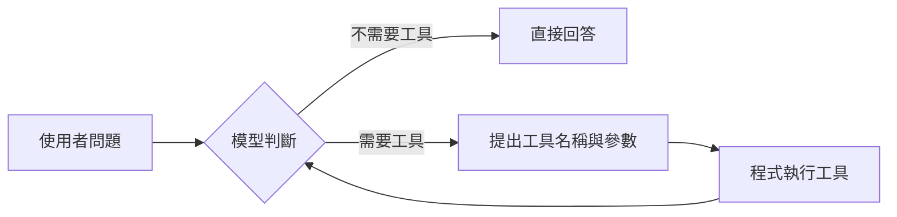
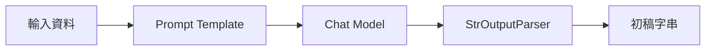
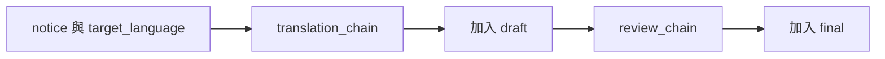
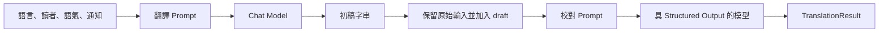

# Day 1 講義：從一則通知開始設計 AI 流程

## 課程大綱

1. 第一單元：生成式 AI 基礎，從單次呼叫到 AI Agent。範例：完成版預覽。
2. 第二單元：如何讓每個人的 Python 環境一致。範例：`pyproject.toml`、`uv.lock`。
3. 第三單元：同一份程式如何切換兩家模型。範例：`01_model_call.py`。
4. 第四單元：如何把翻譯要求寫成可重複使用的 Prompt，並示範任務邊界與連續對話。範例：`02_translator_prompt.py`、`02a_guardrail_prompt.py`、`02b_conversation_memory.py`。
5. 第五單元：如何把回答整理成程式可讀的固定欄位。範例：`03_structured_output.py`。
6. 第六單元：模型除了文字之外，還能怎麼看、怎麼聽。範例：`05_multimodal.py`。
7. 第七單元：如何串成 Chain，並完成當日翻譯器。範例：`04_chain.py`、`06_final_translator.py`。

---

# 第一單元：從生成式 AI 應用到 AI Agent

## 1.1 生成式 AI 如何產生回答

平常在 ChatGPT 或 Gemini 輸入一句話，幾秒後就得到一段流暢的回答。這段回答是怎麼來的？

大型語言模型（LLM，Large Language Model）是用大量文字訓練出來的程式。訓練完成後，它做的事情可以濃縮成一句話：**根據前面出現過的文字，反覆預測「下一個字最可能是什麼」**，一個字接一個字，直到組成完整回答。可以想成一種訓練有素的文字接龍：模型沒有查資料庫，也沒有翻書，它是憑訓練時學到的統計規律，把最可能的字接出來。

因此LLM 有三個特性：

1. **同一個問題，每次回答可能不同。** 預測帶有隨機成分，模型不是從固定答案庫撈答案。
2. **知識有截止日。** 模型只見過訓練資料。訓練之後發生的事，以及從未公開的內部文件（例如學校的校規），它都不知道。
3. **它可能一本正經的說錯。** 模型的目標是接出「看起來合理」的文字，不是「查證過」的文字。當缺少資料時，它仍可能編出流暢但錯誤的內容，這種現象稱為幻覺（Hallucination）。

因此，生成式 AI 的回答不等於「正確答案」，而是「模型認為最合理的文字」。要讓它回答正確，得在 Prompt 裡提供完整資訊，或由程式先查資料，再把資料交給模型，這也是目前LLM系統多數會提供tools的原因，透過tools讓模型可以感知外部的即時資訊，可以提高回答的正確性，可以連接外部系統，以AI Agent角度來說，便具備了手腳可以操作。

## 1.2 聊天視窗與寫程式呼叫模型，差在哪裡

首先一個常見的誤解：ChatGPT 網頁不是模型本身。它是一個包著聊天介面的應用程式，當你輸入文字後，它把文字送到遠端的模型服務，取回結果，再顯示在畫面上。程式與程式之間的這種溝通窗口，稱為 API（Application Programming Interface）。

也就是說，聊天網頁和我們今天要寫的程式，走的是同一條路：

```text
聊天網頁：你輸入文字 → 網頁把文字送到模型 API → 畫面顯示回答
自己的程式：程式組好指示 → 程式把文字送到模型 API → 程式處理回答
```

送給模型的完整指示與資料，稱為 Prompt。在聊天視窗裡，Prompt 就是你打的那句話；在程式裡，Prompt 由程式組裝，可以包含固定規則、當次任務和待處理的資料。

既然聊天視窗就能得到答案，為什麼還要寫程式？以翻譯親師通知為例：

| 面向         | 聊天視窗                         | 寫程式呼叫                    |
| ------------ | -------------------------------- | ----------------------------- |
| 要求的完整性 | 每次都要重新交代語言、對象、語氣 | 規則寫在程式裡，每次自動帶上  |
| 結果的穩定性 | 依當次輸入而定                   | 相同規則可重複執行、可比較    |
| 後續處理     | 人工複製貼上                     | 可直接存檔、送 LINE、寫入系統 |
| 檢查機制     | 靠人眼                           | 可由程式驗證欄位與格式        |

聊天視窗適合一次性的問題；要反覆、穩定、可檢查的處理同一類工作，就得把要求寫進程式。

## 1.3 模型沒有記憶：單輪對話與連續對話

在 ChatGPT 連續聊了十句，它還記得第一句，於是很多人以為模型「有記憶」。實際上正好相反：**每一次 API 呼叫，對模型來說都是全新的開始**，它完全不記得上一次呼叫的內容。

那聊天網頁為什麼記得？因為那個應用程式在每次送出新問題時，把**之前的對話紀錄整份附在 Prompt 裡**一起送過去。模型看起來有記憶，其實是應用程式每次都重新提醒它。

```text
單輪對話：這次的問題 ──────────────→ 模型
連續對話：對話歷史 + 這次的問題 ──→ 模型
```

這個區分有兩個實務意義。第一，「連續對話」是應用程式的功能，不是模型的能力；要做出記得使用者說過什麼的校園服務系統，得由程式負責保存並附上對話紀錄。第二，附上的歷史越長，送出的文字量越大，費用與延遲也越高（文字量的計量單位稱為 Token，後面會說明）。

後面的 `02b_conversation_memory.py` 會直接把這個概念做成最小範例：同一則第二輪訊息，一次不附前文、一次附回前文，讓差異直接出現在畫面上。

## 1.4 從單次呼叫，到會查資料、用工具的 AI Agent

生成式 AI 應用的發展路線：單次呼叫 → 固定流程（Chain）→ RAG 與 Tool Calling → AI Agent。

### 單次呼叫

你送出一個 Prompt，模型憑訓練時學到的知識回傳一次結果。改寫、摘要、翻譯這類「材料都已放在 Prompt 裡、一步就能完成」的任務，用單次呼叫就夠了。

```text
通知 → 模型 → 譯文
```

限制：模型拿不到訓練資料以外的內容，例如學校的校規或這學期的行事曆。

### Chain：步驟由程式先排好

如果翻譯完還要校對，可以把兩個步驟固定串起來，每次都先翻譯、再校對。這種由程式預先排定步驟的流程，稱為 Chain。

```text
通知 → 翻譯 → 校對 → 最終譯文
```

這條路徑非常明確：模型可以改變文字，但執行順序由程式決定。

### RAG 與 Tool Calling：替模型補上它沒有的資料

模型答不了「借書證遺失怎麼辦」，不是它不夠聰明，而是校規不在訓練資料裡。補救的方式有兩類。RAG（Retrieval-Augmented Generation，檢索增強生成）由程式先從文件庫找出相關段落，連同問題一起放進 Prompt；Tool Calling 則是把可用的工具清單（例如「查詢行事曆」）告訴模型，模型判斷需要時，提出「呼叫哪個工具、帶什麼參數」的要求，再由程式實際執行函式，把結果交回模型。

```text
RAG：問題 → 程式檢索文件 → 文件＋問題 → 模型 → 回答
Tool Calling：問題 → 模型提出工具需求 → 程式執行工具 → 結果交回模型 → 回答
```

### Agent：模型參與決定下一步

有些任務無法事先排成單一路線。例如，使用者可能問一般問題，也可能查詢校務日期；模型得先判斷需不需要工具，再根據工具結果繼續處理。這種由模型根據目標與目前狀態，反覆進行「判斷 → 選擇工具 → 取得結果 → 再判斷」，直到完成任務或達到終止條件的流程，稱為 AI Agent。



這裡有個容易誤會的地方：Tool Calling 只產生「工具名稱與參數」，實際的 Python 函式仍由應用程式執行。

前三種流程的共同點是「下一步由程式決定」，Agent 則讓模型參與決定下一步。所以聊天應用與 AI Agent 的分界不在介面長相，而在**誰決定下一步**：Agent 是由模型、Prompt、工具、狀態與執行迴圈組成的一套系統，聊天視窗只是它可能的外觀之一。

市面上已有成熟的 Agent 產品可以對照這個概念：OpenClaw 可以在個人裝置上執行，同時接多種模型、工具與通訊管道；Hermes Agent 則著重持續記憶與自我改進迴圈。

## 1.5 為什麼需要 LangChain

本課程會用 Python 同時操作 Gemini 與 Azure OpenAI 兩家服務。若直接呼叫各家 API，馬上會遇到現實問題：兩家的套件、參數與回傳格式都不同，更換供應商就得改寫大段程式；Prompt 組裝、輸出解析、文件檢索、工具定義這些常見工作，也得各自重複實作一次。

LangChain 是為此而生的開發框架，它把「模型、Prompt、輸出格式、檢索、工具」整理成一致的介面。

1. **換模型不換程式**：Gemini 與 Azure OpenAI 都實作同一個 Chat Model 介面，主程式不必知道背後是哪一家。
2. **常用元件現成**：Prompt Template（提示樣板）、Structured Output（結構化輸出）、Retriever（檢索器）等都有標準寫法，不必自己重複打造。
3. **往 Agent 的路是通的**：需要自行控制狀態、分支與多步驟流程時，由同一家族的 LangGraph 接手。

## 1.6 今天的任務：校園通知翻譯器

概念到此，回到今天實際要做的事。要處理的是學校裡很常見的任務：把親師通知翻譯成不同語言，並依照讀者是家長還是學生，調整表達方式。

把通知貼進聊天視窗，通常很快就能拿到譯文。麻煩的點會出在下一次：換了通知、換了讀者或語言，所有要求都得重新交代一遍；模型偶爾還會補上原文沒有的日期、地點或規定。

舉一個具體例子。假設你收到這段文字：

> 明日戶外教育因天候不佳延期，新的日期將另行通知，請學生照常到校上課。

如果只對模型說一句「翻成日文」，得到的譯文多半很流暢。不過流暢不等於正確。請先檢查兩件事：「日期尚未決定」和「照常到校上課」是否完整保留？模型有沒有自行補出一個活動日期？校務文字要先守住原意，才有餘裕調整語氣和風格。

翻譯通知的步驟固定，不需要模型決定下一步。因此採用簡單的一般一問一答的固定流程：

```text
Prompt Template → Chat Model → Structured Output
```

三個元件各有分工。
* Prompt Template 是可重複使用的任務說明，語言、讀者這些會變動的部分留成可替換欄位。
* Chat Model 負責生成，例如:用 Gemini 與 Azure OpenAI。
* Structured Output 則要求模型依固定欄位作答，好讓譯文、重要術語和待確認項目分開處理。

---

# 第二單元：使用 uv 管理專案

接下來的範例會用到 LangChain、模型供應商的整合套件。如果每部電腦各裝各的版本，一出錯就很難判斷問題出在程式、設定還是套件，即便在同一台電腦也會因不同的專案需求，而導致版本管理混亂。uv 會按照專案內的版本記錄準備環境，讓每個人都從相同起點執行，並且 uv 是現在許多 python 專案的主流使用的隔離環境套件。

在開始同步專案之前，先把課堂要用的三個工具準備好：VS Code 是編輯器，Python 是實際執行程式的直譯器，uv 則負責安裝或挑選 Python 版本、建立隔離環境，以及依照 `pyproject.toml` 與 `uv.lock` 同步套件。

## 2.1 課前安裝：VS Code、uv 與 Python

### 第一步：安裝 VS Code

請先安裝 VS Code。課堂中的程式編輯、整合終端機、Markdown 預覽與除錯，都會在這個編輯器中完成。

### 第二步：安裝 uv

Windows：

```powershell
winget install --id=astral-sh.uv -e
uv --version
```

macOS：

```bash
brew install uv
uv --version
```

若 `uv --version` 能印出版本號，代表安裝成功。若終端機仍顯示找不到 `uv`，先完全關閉目前的終端機視窗，再重新開啟一次，讓新的 `PATH` 設定生效。

### 第三步：用 uv 準備課堂的 Python 版本

本專案接受 Python 3.11 到 3.13，但為了讓課堂環境更一致，建議統一使用 Python 3.12：

```powershell
uv python install 3.12
uv python list
```

若畫面中看得到 `3.12`，就代表 Python 已經準備完成。uv 也可以在需要時自動下載缺少的 Python 版本，但課堂中先明確安裝好，後續除錯會比較單純。

### 第四步：安裝 VS Code 的 Python 工具

在 VS Code 的 Extensions 頁面安裝以下工具：

- `Python`：提供執行、除錯、測試與解譯器選擇功能。
- `Pylance`：提供自動完成、型別推論與程式碼導覽。
- `Ruff`（選用）：若想在編輯時直接看到 Python 檢查結果，可以一併安裝。

安裝完成後，重新開啟 VS Code。

* 全新專案，建立空資料夾，並在裡面執行以下指令：
```
mkdir myproject
cd myproject

uv init --python 3.12
uv sync
```

各指令的作用如下：
1. uv init --python 3.12：初始化 Python 專案，並且在目前專案建立 .python-version，指定使用 Python 3.12，uv 即使發現 Python 3.12 尚未安裝，通常也會在建立環境時自動下載
2. uv sync：建立 .venv 並同步專案相依套件


* 現有專案已經是 uv 專案，先切換到專案根目錄，再執行，直接在專案資料夾執行：
```
uv sync
```

uv 會根據 pyproject.toml 與 uv.lock：
建立或更新 .venv
安裝指定的 Python 版本
同步專案相依套件

## 2.2 uv 管理了哪些內容

uv 用 `pyproject.toml` 記錄專案需要哪些套件，用 `uv.lock` 記錄實際解析出的精確版本，並在 `.venv` 建立隔離環境。

| 檔案或資料夾      | 作用                                | 是否手動修改         |
| ----------------- | ----------------------------------- | -------------------- |
| `pyproject.toml`  | 專案名稱、Python 版本與相依套件範圍 | 可以                 |
| `uv.lock`         | 跨平台的精確相依版本                | 不建議，交由 uv 管理 |
| `.venv`           | 專案隔離的 Python 與套件            | 不修改、不提交 Git   |
| `.python-version` | 專案預設 Python 版本                | 視專案需要修改       |

## 2.3 uv 如何建立專案

以下指令展示 uv 如何從空資料夾建立專案。這一段只需要閱讀理解，請不要在 Day 1 資料夾裡重做：

```powershell
uv init scratch-day1
Set-Location scratch-day1
uv add langchain python-dotenv
uv run python -c "import langchain; print(langchain.__version__)"
```

最後一行會在 uv 管理的環境中匯入 LangChain 並印出版本。第一次執行時，資料夾裡也會出現 `.venv` 和 `uv.lock`。

若終端機不認得 `uv` 這個指令，先確認安裝狀態：

```powershell
uv --version
```

仍然無法辨識時，重新開啟終端機，並檢查 uv 的安裝路徑是否已加入 `PATH`。

## 2.4 同步 Day 1 專案

在課程提供的 `day1` 資料夾執行：

```powershell
uv sync
```

`uv sync` 完成後，Python 版本應介於 3.11 至 3.13。

第一次在 VS Code 開啟這個專案時，請按 `Ctrl+Shift+P`，執行 `Python: Select Interpreter`，選擇 `day1/.venv` 底下的 Python。這一步能確保編輯器的自動完成、錯誤提示與測試都對準課堂使用的環境，而不是誤用你電腦上其他 Python 安裝。

接著花 5 分鐘打開 `pyproject.toml`，找出兩件事：Python 版本範圍，以及 Gemini、Azure OpenAI 各自使用的 LangChain 整合套件。`uv.lock` 打開看一眼就好，不要手動修改；它記錄的是 uv 解析出的精確版本，內容應交由 uv 更新。

<details>
<summary>展開參考答案</summary>

Python 版本範圍是 `>=3.11,<3.14`，兩個模型整合套件分別為 `langchain-google-genai` 與 `langchain-openai`。`uv.lock` 記錄 uv 解析出的精確版本，手動修改可能使檔案與實際相依關係不一致。

</details>

若想先確認範例真的能在這個環境執行，可以先跑第一支範例的說明畫面：

```powershell
uv run examples/01_model_call.py --help
```

看到參數說明就代表環境就緒；這一步還不需要 API Key。

---

# 第三單元：雙模型第一次呼叫

這個單元把同一份通知分別交給 Gemini 與 Azure OpenAI。程式與輸入固定，只換 provider，不然分不清差異來自模型還是環境。先說清楚一個前提：一次測試只能說明這個範例在這一題上的結果，它不會告訴你哪一家在所有任務上都比較好。

## 3.1 基礎概念：金鑰、端點與 Token

寫程式呼叫模型服務之前，先認識三個馬上會用到的名詞。

**API Key（金鑰）**：呼叫模型服務時的身分憑證，形式上是一串長字串。服務商用它辨認「這次呼叫是誰、額度算在誰頭上」。金鑰等同於帳號的使用權，因此不能寫死在程式碼裡，也不能出現在截圖或聊天訊息中。

**Endpoint（端點）與模型名稱**：Endpoint 是模型服務的網址，決定請求送到哪裡；模型名稱決定由哪一個模型處理。Gemini 由整合套件依官方 API 自動連線，只需指定模型 ID；Azure OpenAI 則要提供自己資源的 Endpoint，並以 Deployment Name（部署名稱）指定模型。

**Token**：模型計算文字長度與計費的單位。文字送進模型前會先被切成一個個 Token，中文一個字通常對應一個以上的 Token。輸入與輸出的 Token 數，決定每次呼叫的費用與延遲；免費層的速率限制也以 Token 數或請求數計算。

這三項設定都屬於「會變動、不該寫進程式碼」的資訊，慣例是放在環境變數中。環境變數是作業系統層級的鍵值設定，程式啟動時讀取；開發時常用專案根目錄的 `.env` 檔案保存這些鍵值，再由 `python-dotenv` 這類套件載入。這也是為什麼每個範例目錄都有 `.env.example`：它列出需要哪些變數，但只放假值；真正的金鑰由你複製成 `.env` 後自行填入。

## 3.2 兩家 API 的共同點與差異

| 面向           | Gemini Developer API       | Azure OpenAI v1 API    |
| -------------- | -------------------------- | ---------------------- |
| 驗證           | `GOOGLE_API_KEY`           | `AZURE_OPENAI_API_KEY` |
| LangChain 類別 | `ChatGoogleGenerativeAI`   | `ChatOpenAI`           |
| 模型設定       | Gemini model ID            | Azure Deployment Name  |
| 端點           | 套件依 Gemini API 設定連線 | `.../openai/v1/`       |


Gemini 整合支援 Tool Calling、Structured Output、Token usage 與多模態輸入。Azure OpenAI v1 API 不再要求日期式 `api-version`，並可使用 OpenAI 相容介面。

## 3.3 安全設定 `.env`

Windows：

```powershell
Copy-Item .env.example .env
```

macOS 或 Linux：

```bash
cp .env.example .env
```

`.env` 只存在本機：不提交 Git。範例的 `.gitignore` 已經排除它。

順帶說明本日指令的寫法：課程以 Windows PowerShell 為準，較長的指令會用 PowerShell 的續行符號反引號換行；macOS 或 Linux 的學員請改用反斜線（\）續行。

### Gemini 設定

```dotenv
MODEL_PROVIDER=gemini
GOOGLE_API_KEY=replace-with-your-google-api-key
GEMINI_MODEL=gemini-3-flash-preview
GEMINI_TTS_MODEL=gemini-3.1-flash-tts-preview
```

Gemini 免費層是否適用，以及 RPM（每分鐘請求數）、TPM（每分鐘 Token 數）、RPD（每日請求數）等額度與資料使用政策，會依模型及帳號方案調整，請以官方 API Key 與定價頁面為準。

### Azure OpenAI 設定

```dotenv
MODEL_PROVIDER=azure
AZURE_OPENAI_ENDPOINT=https://YOUR-RESOURCE-NAME.openai.azure.com/openai/v1/
AZURE_OPENAI_RESOURCE_ENDPOINT=https://YOUR-RESOURCE-NAME.openai.azure.com/
AZURE_OPENAI_API_KEY=replace-with-your-azure-openai-api-key
AZURE_OPENAI_MODEL=gpt-5.5
```

兩個 Endpoint 指向同一個 Azure OpenAI 資源，但格式不同：`AZURE_OPENAI_ENDPOINT` 包含 `/openai/v1/`，供一般 v1 API 使用；`AZURE_OPENAI_RESOURCE_ENDPOINT` 不含 `/openai/v1/`，供第六單元的 STT 使用。

要特別注意，`AZURE_OPENAI_MODEL` 填的是 Deployment Name。若 Azure 入口網站中的部署名稱與公開模型名稱不同，必須填部署名稱。

設定完成後，不要用印出 `.env` 的方式驗證。直接執行下一節的範例即可，錯誤訊息會告訴你缺少哪個欄位。

## 3.4 閱讀模型工廠

打開 `examples/model_factory.py`。這份檔案的角色像一個轉接頭：主程式只提出「給我一個 Chat Model」，至於接上 Gemini 還是 Azure，由工廠決定。

先找到 `create_chat_model()`：

```python
def create_chat_model(provider: str | None = None) -> BaseChatModel:
    selected = get_provider(provider)
    if selected == "gemini":
        return ChatGoogleGenerativeAI(...)
    return ChatOpenAI(...)
```

程式碼中的省略號只是講義導讀用的簡化，實際設定請以檔案內容為準。`MODEL_PROVIDER` 決定建立 Gemini 或 Azure 的模型物件，金鑰一律從環境變數讀取。兩條分支最後都回傳 LangChain 的 `BaseChatModel`，所以主程式可以用同一種方式呼叫。

還有一個小細節：Gemini 3 系列回應的 `content` 可能是 content blocks，LangChain 提供 `.text` 屬性統一取出文字內容。因此範例一律使用：

```python
response = model.invoke(messages)
print(response.text)
```

## 3.5 執行第一次呼叫

```powershell
uv run examples/01_model_call.py --provider gemini
uv run examples/01_model_call.py --provider azure
```

畫面會依序出現模型供應商、改寫結果和 Token 用量。有些回應不含用量資料，程式會直接標示這個情況，其他輸出仍可正常使用。

比較時先看事實是否維持、內容是否完整，再看語氣和文句風格。接著做一個小實驗，測試模型會不會自行補寫資料：打開 `examples/01_model_call.py`，把 `NOTICE` 換成這則日期尚未決定的通知：

> 明日戶外教育因天候不佳延期，新的日期將另行通知，請學生照常到校上課。

再次執行兩家模型，記錄是否有模型補出新的活動日期。若有，這屬於事實錯誤，不能歸類為文句風格差異。

## 3.6 常見錯誤排除

| 狀態    | 判斷                                      | 處理方式                             |
| ------- | ----------------------------------------- | ------------------------------------ |
| 401     | 金鑰錯誤、過期或被撤銷                    | 重新取得金鑰並更新 `.env`            |
| 403     | 帳號、專案或部署沒有權限                  | 檢查 Gemini 專案或 Azure 存取權      |
| 404     | 模型 ID、Deployment Name 或 Endpoint 錯誤 | 逐項比對開課設定                     |
| 429     | 超過速率或每日額度                        | 停止連續重試，稍後再試或切換備援模型 |
| Timeout | 校園網路、代理伺服器或服務延遲            | 先測試網路，再檢查供應商狀態         |

到這裡，兩家模型已經共用相同的主程式介面，但翻譯要求仍直接寫在程式字串裡。接下來，就是把語言、讀者和語氣抽成可替換欄位，讓同一份 Prompt 可以反覆使用。

---

# 第四單元：Prompt 設計

## 4.1 基礎概念：Prompt 的訊息結構與 Template

Prompt 是送給模型的完整指示與資料，到目前為止，它看起來像「一段話」；實際上，送進 Chat Model 的 Prompt 是一份訊息清單，每則訊息各有角色：

- **System Message**：給模型的長期角色、行為原則與限制，例如：「你是臺灣學校的多語行政助理，不要補充原文沒有的資訊」。
- **Human Message**：本次任務與待處理的資料，例如：這一則要翻譯的通知。
- **AI Message**：模型先前的回覆。單輪對話用不到；連續對話時，程式把它與歷史一起附回，模型才「記得」上下文。

規則放 System、資料放 Human，「規則」和「待處理的通知」一眼就能區分。要提醒的是，應用程式仍須驗證輸入與輸出，System Message 不能當成完整的安全機制。

再來是第二個概念，先前的範例指示直接寫在程式字串裡，只要讀者、語言或語氣一改，就得修改程式。Prompt Template（提示樣板）解決的正是這個問題：像一張學校常用的公文範本，固定不變的規則保留下來，會改變的部分挖成 `{target_language}`、`{audience}` 這類可替換欄位，每次使用時填入當次的值。

```python
PROMPT = ChatPromptTemplate.from_messages(
    [
        ("system", "你是臺灣學校的多語行政助理……"),
        ("human", "待處理通知：\n{notice}"),
    ]
)
```

`ChatPromptTemplate` 把固定指令與每次變動的資料分開，減少用字不一致，也讓同一份 Prompt 可以重複測試。

## 4.2 一份可修改的 Prompt 應包含什麼

| 元素     | 本課程範例             | 缺少時的風險               |
| -------- | ---------------------- | -------------------------- |
| 角色     | 臺灣學校的多語行政助理 | 用詞可能不符合校園情境     |
| 任務     | 翻譯通知               | 模型可能改寫或摘要而非翻譯 |
| 讀者     | 學生家長               | 用字難度與稱謂不穩定       |
| 語氣     | 清楚、親切且正式       | 兩次輸出風格差異過大       |
| 限制     | 不要補充原文沒有的資訊 | 模型可能補充看似合理的內容 |
| 輸出要求 | 只輸出譯文             | 可能多出說明或前言         |

## 4.3 執行與修改

```powershell
uv run examples/02_translator_prompt.py `
  --provider gemini `
    --language 日文 `
  --audience 學生家長 `
  --tone "清楚、親切且正式"
```

### Lab1：同一語言，改變讀者

**難度：Level 1｜不用改程式碼**

```powershell
uv run examples/02_translator_prompt.py --audience "國小三年級學生" --language 日文
```

觀察句子長度、詞彙難度與稱謂。

### Lab2：改變限制

**難度：Level 2｜修改 `NOTICE` 與 System Message**

這個練習要動 `02_translator_prompt.py` 的兩個地方。先把檔案開頭的 `NOTICE` 換成 1.6 那則日期尚未決定的戶外教育通知，再暫時移除 System Message 中「不要補充原文沒有的資訊」這條限制，觀察模型是否開始補出日期、地點或聯絡方式。完成觀察後，把限制加回去，`NOTICE` 也一併還原。

比較前後結果，看看明確的限制是否降低了模型自行補寫的機率。要注意，一句 Prompt 無法排除所有錯誤，這個實驗只觀察限制文字帶來的影響。

### Lab3：加入 Few-shot

**難度：Level 3**

在 Prompt 中加入一組簡短的輸入與理想輸出，示範「親師座談」的固定翻譯。Few-shot 的意思是用少量範例界定格式或用詞，這裡放一組就足以觀察效果。

這份教材的現有範例是最簡單的 `system + human` 結構，因此這個 Lab 先不要改 Prompt 結構，而是直接把 Few-shot 示例補在原本的 System Message 裡。可直接參考下面這個最小 sample：

```python
PROMPT = ChatPromptTemplate.from_messages(
    [
        (
            "system",
            "你是臺灣學校的多語行政助理。請將通知翻譯成{target_language}，"
            "讀者是{audience}，語氣為{tone}。保留日期、時間、地點與專有名詞；"
            "不要補充原文沒有的資訊。只輸出翻譯結果。\n\n"
            "下面是一組翻譯示範：\n"
            "示範輸入：各位家長您好，明天下午兩點將舉行親師座談，請於一點五十分前到校。\n"
            "示範輸出：\n"
            "保護者の皆様へ\n"
            "明日の午後2時に保護者会を開催いたしますので、1時50分までにご来校ください。",
        ),
        ("human", "待處理通知：\n{notice}"),
    ]
)
```

這組 Few-shot 的作用，不是提供新知識，而是示範你希望模型如何處理這類校務通知。這裡刻意示範四件事：

1. 「親師座談」固定翻成 `保護者会`。
2. 時間資訊要完整保留，不能漏掉「兩點」與「一點五十分」。
3. 語氣要正式、清楚，適合家長閱讀。
4. Few-shot 的語言要和當次任務一致；這個 sample 用的是日文，所以練習時也先固定用 `--language 日文` 觀察效果。

加完後，請重新執行 `02_translator_prompt.py`，觀察模型對「親師座談」這類固定詞的翻譯是否比原本更穩定。若之後把目標語言改成英文或印尼文，這組 Few-shot 也應一起換成同語言的示範，否則反而可能干擾輸出。

無論加了多少規則，Prompt 都只能降低錯誤機率，無法保證事實正確。日期、金額、學生資格或行政規定，仍需要程式驗證或人工確認。

## 4.4 Prompt 防護：限制任務邊界

只要把模型包成聊天介面，幾乎一定會有人試著拿它做原任務以外的事，例如把客服拿去算數學、說笑話或寫程式。這類情境不能只靠「相信使用者不會亂問」，而是要先在 System Message 中把角色、允許任務與拒答方式寫清楚。

這裡先示範最簡單的一層防護：

1. 先把模型角色固定成「臺灣學校的多語行政助理」。
2. 只允許兩類任務：翻譯校務通知、說明通知重點。
3. 超出範圍時，不進入討論，直接回覆固定拒答句。

```powershell
uv run examples/02a_guardrail_prompt.py --provider gemini
uv run examples/02a_guardrail_prompt.py --provider azure
```

這支範例會連續送兩個請求：第一個屬於允許範圍，第二個刻意要求數學、笑話與程式碼。請觀察模型是否把超出範圍的要求收斂成固定拒答。

這裡要刻意提醒一次：Prompt 防護只能降低濫用機率，不能取代真正的權限控管、輸入驗證與輸出檢查。真正上線的系統，仍要在應用程式層補上規則。

## 4.5 連續對話：把歷史重新附回 Prompt

前面提過，模型本身沒有記憶；看起來像記得，是因為應用程式做了額外的處理，其中最簡單的方式就是把前文重新附回去。

`02b_conversation_memory.py` 會先做第一輪對話：使用者指定「接下來都翻成日文，讀者是學生家長，語氣清楚、親切且正式」。第二輪只再丟一句「那這則呢？」加上一則通知，然後分別跑兩次：

1. **無記憶**：第二輪只送出這次訊息，不附前文。
2. **有記憶**：把第一輪使用者訊息與模型回覆，一起附回第二輪 Prompt。

接著第三輪會直接追問模型：「我先前問過哪些問題？」，無記憶時，模型應該只能承認看不到前文；有記憶時，則能列出第一輪設定翻譯條件，以及第二輪丟出的通知內容。

```powershell
uv run examples/02b_conversation_memory.py --provider azure
uv run examples/02b_conversation_memory.py --provider gemini
```

若 System Message 有要求「缺少條件時不要自行假設」，那麼無記憶那次通常會指出缺少目標語言、讀者或語氣；有記憶那次則能直接翻譯。第三輪再追問「我先前問過哪些問題」時，差別會更直接：沒有附帶歷史，就沒有東西可以回想；附了歷史，模型才有材料可以整理。這正是聊天應用常見的「記憶」效果：不是模型自己保存了狀態，而是程式每次都幫它重送狀態。

Prompt Template 到此不只解決了「如何穩定描述任務」，也示範了如何限制任務邊界與如何把對話歷史附回；但輸出仍是一整段文字。

---

# 第五單元：Structured Output（結構化輸出）

## 5.1 基礎概念：為什麼需要 Structured Output

模型的回答預設是一整段自然語言文字，適合直接顯示給人閱讀。可是當程式需要接手後續工作時，例如：把譯文寫入資料庫、把待確認事項送給承辦人、把結果傳給 LINE Bot，就會遇到一個問題：程式讀不懂「大概在第二段」這種位置，它需要明確知道「譯文在哪個欄位、術語在哪個欄位」。

解決方式分兩步。
* 第一步，先定義 Schema：資料的欄位與型別規格，好比一張固定格式的校務表單，規定每一欄叫什麼名字、該填文字還是清單。
* 第二步，要求模型按照 Schema 回傳資料，而不是自由發揮。這種做法稱為 Structured Output（結構化輸出）。

在 Python 裡，Schema 用 Pydantic 定義。Pydantic 是廣泛使用的資料驗證套件：以 Python class 描述欄位與型別，資料進來時自動檢查，不符合就產生明確的錯誤訊息。LangChain 的 `with_structured_output()` 把兩者接起來：傳入 Pydantic Schema，模型的回覆就會被要求符合這張表單，並在回到程式之前完成欄位與型別驗證。

## 5.2 閱讀 Schema

```python
class TranslationResult(BaseModel):
    translation: str = Field(description="完成翻譯與語氣調整後的通知")
    key_terms: list[str] = Field(description="需要維持一致翻譯的重要校園用語")
    items_to_verify: list[str] = Field(
        description="原文不明確、需要人工確認的資訊；若無則為空陣列"
    )
```

欄位名稱讓程式辨認資料，`description` 則告訴模型每一欄該填什麼。其中 `items_to_verify` 會收集原文不清楚的地方，讓承辦人知道哪些資訊需要再確認。

模型分別填入「譯文」、「重要術語」與「待確認資訊」三欄，Pydantic 負責檢查欄位和型別。至於翻譯內容是否正確，這張表單管不到，仍需另外判斷。

## 5.3 執行範例

```powershell
uv run examples/03_structured_output.py --provider gemini --language 日文
uv run examples/03_structured_output.py --provider azure --language 日文
```

預期結構：

```json
{
  "translation": "...",
  "key_terms": ["..."],
  "items_to_verify": ["..."]
}
```

實際文字由模型產生，每次可能略有不同；這裡要觀察的重點是 JSON 欄位和型別是否穩定。

如果模型輸出不符合 Schema，Pydantic 會拋出驗證錯誤。實務系統常見的處理方式，是把錯誤訊息連同原要求再送回模型重試一次；課程範例為了讓錯誤容易觀察，驗證失敗時直接顯示錯誤、不自動重試。

## 5.4 加入人工查核優先度

目前的 `items_to_verify` 能列出問題，卻沒有告訴承辦人先處理哪一筆。這一節要新增 `risk_level` 欄位，讓日期、金額、資格或原文歧義較多的通知，可以優先安排人工查核。

只需要修改 `examples/schemas.py`，不用改 `03_structured_output.py`。修改後的完整範例可參考：

```python
from typing import Literal

from pydantic import BaseModel, Field


class TranslationResult(BaseModel):
    translation: str = Field(description="完成翻譯與語氣調整後的通知")
    key_terms: list[str] = Field(description="需要維持一致翻譯的重要校園用語")
    items_to_verify: list[str] = Field(
        description="原文不明確、需要人工確認的資訊；若無則為空陣列"
    )
    risk_level: Literal["low", "medium", "high"] = Field(
        description="依日期、金額、資格條件與原文歧義判斷人工複核優先度"
    )
```

其中 `Literal["low", "medium", "high"]` 表示這個欄位只接受三個固定值；`Literal` 來自 Python 內建的 `typing` 模組，所以檔案開頭要記得補上 `from typing import Literal`。

這裡的 `Field(description=...)` 不只是寫給 Python 看。在 Pydantic 裡，它先是欄位的描述資訊；放到 LangChain 的 Structured Output 情境時，欄位名稱、型別和 `description` 通常也會一起成為模型理解 schema 的提示，幫助模型知道每一格應該填什麼內容。

修改 `examples/schemas.py` 後再次執行 5.3 的指令，輸出可參考下面這個範例：

```json
{
  "translation": "保護者の皆様へ\n明日の午後2時に保護者会を開催いたしますので、1時50分までにご来校ください。",
  "key_terms": ["保護者会"],
  "items_to_verify": [],
  "risk_level": "low"
}
```

這裡的 `risk_level` 會根據通知內容不同而改變。若日期未定、資格不清楚，或原文本身有歧義，模型就可能把它判成 `medium` 或 `high`，提醒承辦人優先人工複核。

若出現驗證錯誤，依序檢查三件事：是否已匯入 `Literal`、欄位型別和描述是否正確，最後確認目前使用的 Model 是否支援這種 Structured Output 方法。

### 為何不直接切割字串

或許有人會想，直接切割回覆字串不是更快？

```python
raw = response.text
translation = raw.split("translation:")[1]
```

問題在於模型可能改變大小寫、空白、欄位順序甚至語言，字串切割很容易失效。Structured Output 讓程式直接取得經過型別檢查的欄位，省去猜測自然語言格式的工作。

---

# 第六單元：多模態生成式 AI

前面幾個單元都在處理文字。這一節要把視野打開：模型不只會讀文字，還能接收語音、圖片與影片。

## 6.1 基礎概念：什麼是多模態

模態（Modality）指的是資料的形式：文字、語音、圖片、影片各是一種模態。前面幾個範例都只處理文字，但校園裡的資訊常常不是：家長可能傳來一段語音訊息、老師可能拍一張學習單、活動紀錄也可能是一段影片。多模態（Multimodal）能力，就是讓 AI 應用可以接收與產生文字以外的資料。

技術上有兩條常見路線：

1. **專用模型**：一個模型專做一件事，例如，語音轉文字、文字轉語音或圖片生成。
2. **原生多模態 Chat Model**：模型本身就能同時理解文字、音訊、圖片或影片，GPT、Gemini 是這類代表。

STT（Speech to Text，語音轉文字）與 TTS（Text to Speech，文字轉語音）。

## 6.2 五種能力，兩家供應商怎麼做

| 能力     | Gemini                  | Azure OpenAI                   |
| -------- | ----------------------- | ------------------------------ |
| STT      | Chat Model 直接輸入音訊 | 專用 audio API（STT 部署）     |
| TTS      | LangChain＋TTS 專用模型 | audio.speech API（TTS 部署）   |
| 圖片理解 | content 放入圖片        | content 放入 image_url         |
| 生圖     | LangChain＋付費生圖模型 | images API（生圖部署）         |
| 影片理解 | Chat Model 直接輸入影片 | 無直接介面，需抽影格＋STT 組合 |

這一節統一使用 `examples/05_multimodal.py`。它用 `--task` 選能力、用 `--provider` 選供應商，讓你可以用同一支程式觀察兩條不同路線。

## 6.3 語音轉文字

若先想直接驗證流程，可先使用課程附的 sample 音檔 `examples/data/1.mp3`；若要換成自己的錄音，建議也先放到 `examples/data/` 再用相對路徑指定。

兩家各執行一次：

```powershell
uv run examples/05_multimodal.py --task stt --provider gemini --file examples/data/1.mp3
uv run examples/05_multimodal.py --task stt --provider azure --file examples/data/1.mp3
```

比較時看三件事：標點是否合理、口語贅字（那個、嗯）如何處理、專有名詞是否正確。

## 6.4 文字轉語音

```powershell
uv run examples/05_multimodal.py --task tts --provider gemini --text "各位家長好，明天下午兩點舉行親師座談，請準時到校。"
uv run examples/05_multimodal.py --task tts --provider azure --text "各位家長好，明天下午兩點舉行親師座談，請準時到校。"
```

Gemini 透過 LangChain 的 `ChatGoogleGenerativeAI` 呼叫 TTS 專用模型，產生 `examples/outputs/tts_output_gemini.wav`；Azure 則透過 OpenAI SDK 的 `audio.speech` API，產生 `examples/outputs/tts_output.mp3`。請實際播放兩個檔案，比較聲音、語速與斷句。Gemini Flash TTS 提供免費額度，但頻率限制較嚴格，且免費層內容可能用於改善 Google 產品。

## 6.5 圖片理解

若要測自己的照片，建議先把檔案放到 `examples/data/`，例如 `examples/data/1.png`：

```powershell
uv run examples/05_multimodal.py --task image --provider gemini --file examples/data/1.png
uv run examples/05_multimodal.py --task image --provider azure --file examples/data/1.png
```

用 `--question` 傳入使用者問題，例如「system for agent 的核心是什麼？」。重點是觀察同一張圖在不同任務下的表現差異。

```powershell
uv run examples/05_multimodal.py --task image --provider gemini --file examples/data/1.png --question "system for agent 的核心是什麼？"
uv run examples/05_multimodal.py --task image --provider azure --file examples/data/1.png --question "system for agent 的核心是什麼？"
```

## 6.6 產生圖片

```powershell
uv run examples/05_multimodal.py --task imagegen --provider azure --text "溫馨的校園閱讀週宣傳插圖，水彩風格，不含文字"
```

本節只執行 Azure 生圖，不是因為 Gemini 或 LangChain 不支援圖片生成。`ChatGoogleGenerativeAI` 可以呼叫 `gemini-3.1-flash-lite-image`、`gemini-3.1-flash-image` 等 Gemini 生圖模型，但這些模型目前都不提供 Free Tier，必須先為 Gemini API 啟用付費方案。為避免只使用免費 Gemini API Key 在課堂中直接遇到權限或帳務錯誤，因此不把 Gemini 生圖列為必做範例。Azure 生圖同樣會產生費用，但本課程使用的是已準備好生圖 Deployment 的課程帳號，模型、價格與帳號權限可能調整，實際使用前請以官方模型清單與定價頁面為準。

生成後請打開圖片看一眼，不只確認能不能產出，也要判斷是否適合校園情境。正式使用時仍需注意內容合宜性、著作權與標示方式。

## 6.7 影片理解

Gemini 可以直接處理短影片；若先用課堂附的 sample，可直接指定相對路徑：

```powershell
uv run examples/05_multimodal.py --task video --provider gemini --file examples/data/1.mp4 --question "請整理這段影片的3個重點"
```

本節只執行 Gemini 影片理解，Azure OpenAI 沒有直接的影片理解介面。若要在 Azure 上做類似的事，必須先把影片抽成影格，再把影格送給 Gemini 或 Azure 的 STT 模型，最後再交給 Chat Model 彙整。**單一模型沒有的能力，不代表整個應用做不到，工程上可以拆成多個步驟完成。**

---

# 第七單元：Chain 與完整翻譯器

LangChain 的 Chain，可以想成一條資料處理流水線。把工作拆成數個步驟，再決定資料要依序經過哪些步驟，前面介紹過的 Prompt Template、Chat Model 與 Output Parser，都可以成為流水線中的處理步驟。

LCEL 則提供了另一種簡潔的方式，使用 | 把這些步驟連接起來。例如 prompt | model | parser，代表先建立提示詞，再交給模型回答，最後整理模型的輸出。當我們呼叫這條 Chain 時，LangChain 就會按照連接順序，讓資料依序通過每個步驟。

## 7.1 從 Runnable 理解 LCEL

LangChain 中可以接收輸入、執行工作並產生輸出的元件，統稱為 **Runnable**。本課程已經使用過的 Prompt Template、Chat Model 與 Output Parser 都是 Runnable，因此可以用相同的 `.invoke()` 方法執行，也可以彼此組合。

| Runnable 元件        | 接收的資料         | 產生的資料        |
| -------------------- | ------------------ | ----------------- |
| `ChatPromptTemplate` | 包含樣板欄位的字典 | 組裝完成的 Prompt |
| `Chat Model`         | Prompt             | 模型回覆訊息      |
| `StrOutputParser`    | 模型回覆訊息       | Python 字串       |

LCEL（LangChain Expression Language）是組合這些 Runnable 的宣告式寫法。`|` 表示把左邊的輸出交給右邊；多個 Runnable 以 `|` 串接後，會形成一個 `RunnableSequence`，建立 Chain 只是在定義流程，呼叫 `.invoke()` 時才會真正執行。

```python
translation_chain = TRANSLATE_PROMPT | model | StrOutputParser()

draft = translation_chain.invoke(
    {"target_language": "日文", "notice": "明天下午兩點舉行親師座談。"}
)
```

這裡的資料依序發生三次轉換：輸入先由 `TRANSLATE_PROMPT` 組成訊息，`model` 產生模型回覆，最後由 `StrOutputParser` 取出純文字。因為每一站的輸出型別都能接上下一站的輸入型別，所以可以組成同一條 Chain。



## 7.2 用 LCEL 串接翻譯與校對

單條 `translation_chain` 只能產生翻譯初稿，完整流程還要把初稿交給校對 Chain。校對時同時需要兩份資料：原始通知 `notice` 與翻譯初稿 `draft`。如果只把兩條 Chain 直接用 `|` 連接，原始通知會在第一條 Chain 轉成字串後消失，因此範例使用 `RunnablePassthrough.assign()`。

`RunnablePassthrough` 會讓原始輸入繼續往下傳；`.assign()` 則會執行指定的 Runnable，並把結果加入一個新欄位。打開 `examples/04_chain.py`，核心流程如下：

```python
translation_chain = TRANSLATE_PROMPT | model | StrOutputParser()
review_chain = REVIEW_PROMPT | model | StrOutputParser()

full_chain = (
    RunnablePassthrough.assign(draft=translation_chain)
    | RunnablePassthrough.assign(final=review_chain)
)

result = full_chain.invoke(
    {"target_language": args.language, "notice": NOTICE}
)
```

執行時，同一份資料會逐步增加欄位：

| 階段                 | 當下資料                                      |
| -------------------- | --------------------------------------------- |
| 初始輸入             | `target_language`、`notice`                   |
| 第一個 `assign` 完成 | `target_language`、`notice`、`draft`          |
| 第二個 `assign` 完成 | `target_language`、`notice`、`draft`、`final` |

因此 `review_chain` 可以同時讀到 `notice` 與前一步新增的 `draft`。主程式只需要呼叫一次 `full_chain.invoke()`，不必自行取出初稿再手動傳給校對流程。



分別執行兩家模型：

```powershell
uv run examples/04_chain.py --provider gemini --language 日文
uv run examples/04_chain.py --provider azure --language 日文
```

輸出會同時顯示「第一次翻譯」與「校對後結果」。比較兩段文字，確認校對階段是否修正錯譯或語氣，同時檢查日期與時間有沒有被改動。

## 7.3 把前面元件組成完整翻譯器

`04_chain.py` 的結果仍是普通字串。`06_final_translator.py` 在相同的兩階段流程上，再接回今天學過的三個能力：

1. 第三單元的模型工廠：以 `--provider` 切換 Gemini 與 Azure OpenAI。
2. 第四單元的 Prompt Template：將語言、讀者、語氣與通知填入樣板。
3. 第五單元的 Structured Output：讓校對結果符合 `TranslationResult` Schema。

完整翻譯器先用 `translation_chain` 產生 `draft`，再把原始輸入與 `draft` 交給 `REVIEW_PROMPT`。最後一站不是 `StrOutputParser`，而是套用 `TranslationResult` 的 `structured_model`，因此輸出不再是字串，而是通過欄位與型別驗證的 Pydantic 物件。

```python
translation_chain = TRANSLATE_PROMPT | model | StrOutputParser()
structured_model = model.with_structured_output(TranslationResult)

full_chain = (
    RunnablePassthrough.assign(draft=translation_chain)
    | REVIEW_PROMPT
    | structured_model
)

result = full_chain.invoke(inputs)
```



執行完整版：

```powershell
uv run examples/06_final_translator.py `
  --provider gemini `
  --language 日文 `
  --audience 學生家長 `
  --tone "清楚、親切且正式" `
  --text "各位家長您好，明天下午兩點將舉行親師座談，請於一點五十分前到校。"
```

切換到 Azure OpenAI 時只需要改一個參數：

```powershell
uv run examples/06_final_translator.py --provider azure --language 日文
```

這個流程雖然呼叫模型兩次，仍然是 Chain，不是 Agent。翻譯、校對與結構化輸出的順序已由程式固定，模型只負責每一站的內容，不會自行決定下一步要執行哪個元件。

---
