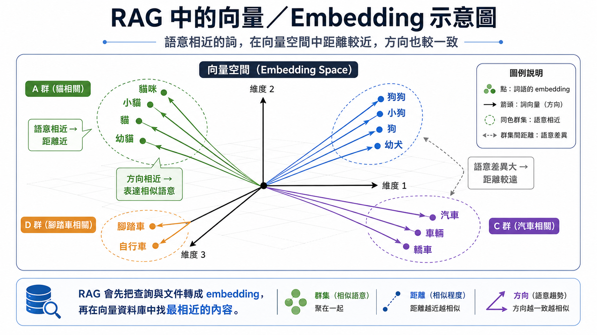
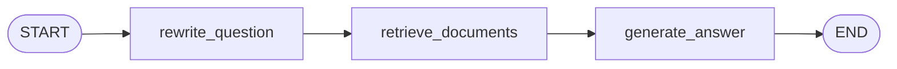
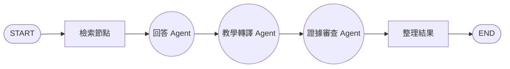

# Day 2 學員講義：讓模型根據校務文件回答

Day 1 的翻譯器有一個簡單前提：通知已經放進 Prompt，模型只要按照指定的語言、讀者和語氣處理文字。我們也已經體驗過模型除了文字之外，還能處理語音、圖片與影片。不過校務問答的難度又多了一層。當家長問：

> 圖書館借書證遺失後，明天還能借書嗎？

如果使用者改問「借書證遺失後還能不能借書」，答案藏在另一份校務文件裡，模型必須先讀到相關規定，才能根據內容回答。

流程上會變成在前面多加一段：

```text
使用者問題 → 找出相關校務文件 → 把文件放進 Prompt → 產生附來源的回答
```

這段流程就是今天的主角 RAG，就是「先替模型找到正確資料，再讓它回答」這件事。這種做法稱為 RAG（Retrieval-Augmented Generation，檢索增強生成），通常也是有效降低模型幻覺的方法。

```text
Day 1：資料已在 Prompt 裡 → 模型處理資料
Day 2：答案藏在文件裡 → 必須先檢索文件 → 再讓模型回答
```

先從一份很短的校規開始：程式讀取整份文件，直接放進 Prompt，再讓模型回答。這個做法不需要向量，也能看見 RAG 的基本順序。接著才處理資料量增加後的問題：三份 Markdown 文件先切成較短的段落，轉成向量存進 Qdrant 向量資料庫，再用問題找回相關段落，產生附有來源的回答。之後會把固定流程改寫成 LangGraph（LangChain 家族中用「節點加狀態」描述流程的框架），再把 Retriever 視為工具，往單一 Agent 與多角色分工推進。

練習使用的三份文件都放在 `data/`，內容完全虛構。實務上找到文件只是第一步，因為文件可能過期、寫錯，甚至夾帶要求模型忽略原有規則的 Prompt Injection（惡意指令注入）。無論流程多完整，最後仍要核對來源和內容。

## 課程大綱

0. 暖身範例：RAG 不一定需要向量，先用整份短校規完成問答。範例：`00`。
1. 第一單元：RAG 是什麼？文件要怎麼切，模型才找得到完整規定。範例：`01`。
2. 第二單元：如何建庫、檢索並判斷候選段落夠不夠，再從 PDF 完成一次 RAG。範例：`02`、`03`、`03a`。
3. 第三單元：如何產生可回查原文的固定 RAG 回答。範例：`04`。
4. 第四單元：LangGraph 如何讓每一步可觀察。範例：`05`。
5. 第五單元：Tool Calling 如何銜接到單一 Agent RAG。範例：`05a_tool_calling.py`、`06`。
6. 第六單元：多角色審查是否值得額外成本。範例：`07`。

## 開始前的設定

課程使用 Python 3.12。第一次進入 `day2` 資料夾後執行：

```powershell
uv sync
```

`uv sync` 會安裝專案需要的套件，並在資料夾內建立 `.venv/`；接著建立產生存放 API 設定的 `.env`。若 `uv sync` 回報找不到 `pyproject.toml`，先執行 `Get-Location`，確認目前確實位於 `day2` 資料夾。系統若無法辨識 `uv`，需先完成 uv 安裝，再重新開啟終端機。


# 暖身範例：沒有向量也能先理解 RAG

**範例：`00_prompt_only_rag.py`**

提到 RAG（Retrieval-Augmented Generation，檢索增強生成），許多人會立刻想到 Embedding、向量資料庫與相似度搜尋。這些工具很常見，但並不是 RAG 的定義。RAG 真正核心的是：是讓 AI 在回答問題之前，先去找資料、再根據找到的內容生成答案的一種技術。

## 先認識向量與 Embedding

先簡單說明向量是什麼。向量（Vector）可以先想成一串有順序的數字，例如：

```text
[0.12, -0.35, 0.81, ...]
```

單看這些數字，人很難理解它們代表什麼。不過電腦可以使用這串數字計算兩段文字是否相近。Embedding（嵌入）就是把一個詞、一個句子或一段文件轉換成向量；負責轉換的模型稱為 Embedding Model 向量模型。

可以把向量空間想成一張很大的「語意地圖」。



這只是一張假想的示意圖。例如：「國王」和「總統」都與國家領導者有關，所以它們在語意地圖上的距離可能比較近；從原點看過去，兩個向量的方向也可能比較接近。電腦可以比較點與點之間的距離，也可以比較兩個向量的夾角，向量方向越接近，Cosine Similarity（餘弦相似度）通常越高。

「香蕉」和「公車」的語意關係較弱，位置通常不會像「國王」和「總統」那麼接近。於是，即使兩段文字沒有使用完全相同的字，電腦仍可根據向量找出語意接近的內容，例如「借書證不見了」和「借閱證遺失」用字不同，轉成向量後仍可能落在相近的位置。

實際的 Embedding 向量不是只有兩個方向，而是可能包含數百或數千個數字，因此無法直接畫在紙上。不同 Embedding Model 建立的語意地圖也不相同，但是要注意的一點是，參考資料以及問題文字在轉成向量時，所使用的 Embedding Model 必須相同，否則在空間維度的表達上就會不一致。

```text
取得參考資料（Retrieval）→ 放入模型輸入（Augmented）→ 產生回答（Generation）
```

但是「取得參考資料」並不一定要使用向量搜尋，資料可以來自 SQL 查詢、API、全文搜尋或檔案讀取。假設：校規只有數十條，而且整份內容都放得進模型的 Context Window，最直接的策略就是讀取整份文件。此時架構就沒有必要先切 Chunk、產生 Embedding，再架設向量資料庫。


執行第一個範例：

```powershell
uv run examples/00_prompt_only_rag.py --provider azure --question "學生證遺失後要先到哪裡登記？"
```

程式沒有建立 `Document`，也沒有使用 Chunk、Embedding 或 Qdrant(向量資料庫)。它只做三件事：讀取 `data/校規.md`、把校規與問題組成 Prompt、呼叫 Chat Model。

這仍可視為最小化的 RAG，但它採用的是「全量取得」：每個問題都取得同一份完整校規，沒有依問題挑選相關段落。這個區分很重要，當文件短、數量少而且內容固定時，全量取得容易理解，也可能已經足夠；但當文件變多、變長後，它會浪費 Token，甚至超出 Context Window。所以後續的向量檢索，是為了解決「資料太多，不能每次全部放入 Prompt」的問題。

再測試一個文件沒有答案的問題：

```powershell
uv run examples/00_prompt_only_rag.py --provider azure --question "校慶園遊會可以使用行動支付嗎？"
```

預期回答應指出校規中查無相關資訊，而不是自行補上一條規定。這也說明一件事：RAG 能讓模型看到參考資料，但不能保證模型一定遵守資料。正式系統仍需加入引用檢查、輸出驗證與人工確認；後續範例會逐步補上這些機制。

# 第一單元：RAG 基礎：先懂原理，再切文件

**範例：`01_documents_and_chunks.py`**

暖身範例已經完成最小的 RAG。接下來要處理的是資料增加後的檢索問題：如何保存文件、切出適合搜尋的段落，並保留來源資訊。

## 1.1 為什麼模型原生答不了校規問題

Day 1 第一單元說過，模型的知識來自訓練資料，而且有截止日。學校的校規、圖書館規則、活動辦法，都不在任何模型的訓練資料裡，就算在，也未必是現行版本。因此，直接把「借書證遺失怎麼辦」丟給模型，只會有兩種結果：它坦白說不知道；或者更糟，它憑相似情境編出一段流暢但無根據的規定，也就是 Day 1 說過的幻覺。

那把整份文件全部貼進 Prompt 呢？三份短文件也許可行，但校務文件動輒數十上百份，全部塞進 Prompt 既超出模型可接收的長度限制，也讓 Token 費用隨文件量暴增；何況多數問題只跟其中一兩段規定有關。

所以問題變成：**每次只把「跟這個問題相關的那幾段文件」找出來，放進 Prompt**。RAG+向量搜尋做的就是這件事。

## 1.2 RAG 是什麼

RAG 的三個字母，拆開來就是它的流程：

- **Retrieval（檢索）**：程式先根據使用者的問題，從文件庫找出最相關的幾個段落。
- **Augmented（增強）**：把找到的段落連同問題一起放進 Prompt，補上模型缺少的資料。
- **Generation（生成）**：模型根據「問題加上這些段落」產生回答，並標明依據。

一個貼近的比喻是開書考試：模型的本事是讀懂與作答（生成），但它手上沒有課本；程式扮演的角色，是先替它翻到正確的那一頁（檢索），把攤開的課本放在它面前（增強），再讓它作答。


跟 Day 1 的程式碼對照，後半段程式大都完全相同：Prompt、Chat Model 和 Structured Output 今天都會再次登場；RAG 增加的是前半段的「找資料」。

## 1.3 一套 RAG 系統的零件

上面的流程需要幾個新零件。先用一張表建立整體印象，今天的單元會逐一深入：

| 零件                 | 一句話說明                               |
| -------------------- | ---------------------------------------- |
| Document             | 保存文件內文與來源資訊的物件             |
| Chunk                | 文件切出的較短段落，是檢索的基本單位     |
| Embedding            | 把文字轉成向量，讓電腦能比較語意相近程度 |
| 向量資料庫（Qdrant） | 保存向量與原文，依相似度找回段落         |
| Retriever            | 接收問題、回傳候選段落的檢索介面         |
| Metadata             | 附在文件上的來源、標題、分類等資訊       |

零件不少，但記住一個順序就不會迷路：**文件先切好（本單元）→ 轉成向量存起來、用問題找回段落（第二單元）→ 交給模型回答（第三單元起）**。

## 1.4 先查原文

打開 `data/校規.md`、`data/圖書館規則.md` 與 `data/活動辦法.md`。先不執行模型，直接從文件裡找出下列三題的答案：

1. 借書證遺失後要怎麼處理？
2. 校外教學同意書最晚何時繳回？
3. 學生證遺失要到哪裡登記？

再查一題：「校慶園遊會可以使用行動支付嗎？」三份文件都沒有提到這件事。人眼讀完三份短文件並不困難。但文件一旦增加到幾百份，逐一打開就不實際了。電腦需要一套固定方式保存內文、來源和位置，後面才有辦法根據問題找回正確段落。

## 1.5 電腦如何保存文件

LangChain 使用 `Document` 物件保存文件：真正的文字放在 `page_content`，來源檔名、標題和分類則放在 Metadata。兩者一起移動，檢索之後才有辦法知道一段規定出自哪裡。

原理上是要把每份文件切成較短的 Chunk（供檢索使用的文字段落）。切得太長，一個結果裡可能混入多條無關規定；切得太短，又可能把適用條件和處理方式拆散。為了降低拆散的風險，相鄰 Chunk 之間會保留少量重複文字，這段重複範圍稱為 Overlap。


本範例按照字元數切分，預設每段最多 280 個字元，相鄰兩段重複 50 個字元：

```text
chunk_size = 280
chunk_overlap = 50
```

實務上，切 Chunk 的方式會依文件長度、段落結構、語言和模型的 Context Window 而不同。這裡先用字元數切分，之後會示範用段落或句子切分，並比較三種切法的差異。


## 1.6 比較三種切法

```powershell
uv run examples/01_documents_and_chunks.py --provider azure
```

預設情況，資料會得到三份原始文件和六個 Chunk。輸出的第一行先顯示 `chunk_id`、`source` 與 `start_index`，下一行才是段落內文。`chunk_id` 是後續引用使用的段落代號；`source` 指向原始檔案；`start_index` 記錄這段文字在原文件中的起點。`title` 和 `category` 也保存在 Metadata 中，稍後的檢索範例會用 `category` 篩選文件。

先從預設結果挑一條同時包含「適用條件」與「處理方式」的規定，再執行兩組不同參數：

```powershell
uv run examples/01_documents_and_chunks.py --chunk-size 180 --chunk-overlap 30
uv run examples/01_documents_and_chunks.py --chunk-size 500 --chunk-overlap 80
```

三次輸出的 Chunk 數量一定不同，但數量本身說明不了哪組參數比較合適。請回到剛才選定的規定，檢查條件與處理方式是否仍留在同一段，並記下觀察：

```text
280/50 時：條件與處理方式在同一段／被切開
180/30 時：條件與處理方式在同一段／被切開
500/80 時：條件與處理方式在同一段／被切開
我會選擇 ______，因為 ____________________。
```

若想再往前一步，可以在任一虛構文件增加一條規定，然後重新執行 `01`，查看新資料是否跟著每個 Chunk 保留下來。

這裡有兩個容易混淆的地方。第一，範例計算的是字元數；正式系統若要掌握模型實際用量，還需要使用對應的 Tokenizer。第二，短文件即使更改參數，也可能始終只有一個 Chunk。

---

# 第二單元：把 Chunk 放進 Qdrant，再找回相關段落

**範例：`02_build_qdrant.py`、`03_similarity_search.py`**

## 2.1 基礎概念：向量、Embedding 與向量資料庫

暖身範例已經用語意地圖的比喻介紹過 Embedding：它把文字轉成向量，使程式可以比較文字在向量空間中的距離或方向。當文件數量增加，不能再把所有內容放進 Prompt，就可以使用這項能力，從多個 Chunk 中找出與問題較接近的段落。

這也解決了只比對字面的限制。關鍵字搜尋容易找到用字相同的段落，卻不一定知道「借書證不見」和「借閱證遺失」意思相近，而使用者提問時通常不會照著規章用字。

一般資料庫擅長「欄位等於某值」的精確查詢，不擅長「在幾萬個向量中找出距離最近的幾個」。專門做這件事的，是向量資料庫。接下來範例使用的 Qdrant 就是其中一套：它保存每個 Chunk 的向量、原文和 Metadata；收到查詢後，先把問題也轉成向量，再找出距離較近的候選段落。要強調的是，回答問題仍是 Chat Model 的工作，Qdrant 只負責保存與檢索。

範例採用 Qdrant Local Mode，資料直接放在 `.qdrant/`，不需要 Docker 或雲端帳號。這種模式適合單機練習，但同一路徑不宜同時開啟多個 client。

最後一個重要規則：建主知識庫和查詢必須使用相同的 Embedding Model。可以把不同模型想成兩套不同的座標系：

```text
文件建庫：Embedding Model A → 向量空間 A
查詢向量化：Embedding Model A → 可比較
查詢向量化：Embedding Model B → 不可比較
```

Model B 即使產生相同維度的向量，座標代表的意義仍可能完全不同。不同模型的向量不能混用，否則檢索結果會不正確，並且維度也可能不同。

## 2.2 建立本機知識庫

```powershell
uv run examples/02_build_qdrant.py --provider azure
```

成功時會看到：

```text
已建立 ...\day2\.qdrant
已寫入 6 個 chunk
```

`02_build_qdrant.py` 會讀取 `.env`，建立 Embedding client，再呼叫第一單元使用過的函式讀取和切分文件。接著清除舊的 `school_documents` collection（collection 是 Qdrant 存放一批向量的集合，類似資料庫中的資料表），把六個 Chunk 重新寫入。每次都重建，是為了讓課堂上修改文件或切分參數之後，不會混到前一次的資料。

重覆執行時，原有 collection 會先被清除，再用新的 Embedding Model 重新建立。請勿拿 Gemini 建出的 `.qdrant/` 直接交給 Azure Embedding 查詢。

接著做一個小實驗：修改一份虛構文件中的規定，先執行 `01` 確認新文字被切進 Chunk，再執行 `02` 重建知識庫。如果只改了 Markdown 而沒有重建，Qdrant 裡仍然是舊向量與舊內容，稍後的查詢也只會看到舊資料。

若建庫失敗，先看狀態碼。401 通常表示金鑰錯誤或失效；404 多半與 Gemini Model ID 或 Azure Deployment Name 有關；429 表示呼叫過於頻繁或額度不足，請停止連續重試。若訊息提到 collection 或檔案被鎖定，請關閉其他仍佔用 `.qdrant/` 的 Python 處理程序（process）。

---

## 2.3 用問題找回候選 Chunk

知識庫建好後，可以用 Retriever（檢索器）送出第一個問題。Retriever 接收查詢文字，回傳幾個候選 Document：

```powershell
uv run examples/03_similarity_search.py --provider azure --query "借書證遺失後還可以借書嗎？" -k 3
```

每筆結果都會顯示排序、相似度分數、Chunk ID、來源和原文。參數 `k` 決定取回幾個候選段落：設得太小，可能漏掉分散在不同段落的答案；設得太大，則會把更多無關文字送進 Prompt，除了增加 Token 用量，也讓模型更容易引用錯誤內容。另外提醒一點，相似度分數只有在 Embedding Model、距離計算方式和資料都相同時，才適合互相比較。

如果問題已明確屬於圖書館規則，可以先用 Metadata Filter 限定 `category`，再做向量檢索。Filter 能縮小搜尋範圍；至於正式系統的資料授權，仍須另外處理。

## 2.4 比較 Top-k 與 Filter

```powershell
uv run examples/03_similarity_search.py --provider azure --query "證件遺失" -k 5

uv run examples/03_similarity_search.py --provider azure --query "證件遺失" --category 圖書館規則 -k 5
```

第一個查詢可能同時找到學生證與借書證的規定；第二個只會在圖書館文件中尋找。請另外準備三個問題：一題可由單一文件回答、一題問法較模糊、一題在資料集中沒有答案。每題分別使用 `k=1`、`k=3`、`k=5`，並選其中一題比較加入 Filter 前後的差異。

到這裡 Qdrant 已經能找出候選段落，但畫面上仍然只有原文。下一步就要把問題和這些段落一起交給 Chat Model，並要求回答附上可回查的引用。

## 2.5 PDF、Word 也要先取出內容

本課使用 Markdown 純文字，所以 Python 可以直接用 `read_text()` 取得內容。實務上的資料來源常是 PDF、Word，或同時包含文字、表格與圖片的 PDF。這些檔案不能只把檔名或檔案路徑交給 Embedding Model；路徑只是檔案的位置，不是文件內容。程式必須先載入檔案並解析內容，再交給後面的切分與 Embedding 流程。[11]

不同檔案需要的前處理也不同：

| 資料來源     | 建立向量前要做的事                                         |
| ------------ | ---------------------------------------------------------- |
| 文字型 PDF   | 使用 PDF Parser 取出每頁文字                               |
| 掃描型 PDF   | 使用 OCR 辨識頁面圖片中的文字                              |
| Word 文件    | 使用 Word Parser 讀取標題、段落與表格                      |
| 圖文混合 PDF | 分別解析文字、表格與圖片；圖片可能需要 OCR 或 Vision Model |

```text
PDF／Word 檔案
  ↓ 程式載入與解析
文字擷取／OCR／表格解析／影像理解
  ↓
LangChain Document（內文＋檔名、頁碼等 Metadata）
  ↓
切成 Chunk → Embedding → 向量資料庫
```

掃描型 PDF 的頁面可能只是一張圖片，一般文字 Parser 讀不到文字時，不代表文件沒有內容，而是需要 OCR。OCR 可以辨識圖片中的字，但流程圖、箭頭、校園地圖或統計圖所表達的關係，可能還要使用 Vision Model 或專門的文件解析服務轉成文字描述。

有些多模態 Chat Model 或 API 支援直接上傳 PDF，但這不代表模型會自行開啟電腦中的檔案，也不等於 RAG 建庫可以省略資料處理。本課使用的文字 Embedding 流程仍須先確認：程式是否真的取出內容、頁碼與來源是否保留、圖片和表格中的重要資訊是否遺失。解析階段沒有取出的內容，後面的向量搜尋也找不到。

## 2.6 實作：從 PDF 建立 RAG

**範例：`03a_pdf_rag.py`**

`data/教育人員任用條例.pdf` 是一份有文字層的 PDF，共 9 頁。這個範例把前面分開練習的步驟串在一起：先由 Python 使用 `pypdf` 逐頁擷取文字並建立 LangChain `Document`，接著切成 Chunk、產生 Embedding、寫入 Qdrant，最後檢索相關段落並交給 Chat Model 回答。

```text
教育人員任用條例.pdf
  ↓ PdfReader 逐頁擷取文字
9 個 LangChain Documents（內文＋檔名＋頁碼）
  ↓ RecursiveCharacterTextSplitter
16 個 Chunks（預設 700／100）
  ↓ Embedding Model
向量
  ↓ Qdrant：.qdrant_pdf/
檢索相關 Chunks
  ↓ Chat Model + RagAnswer
回答、頁碼與原文引用
```

先執行一題文件有明確內容的問題：

```powershell
uv run examples/03a_pdf_rag.py --provider azure --question "教育人員的任用應注意哪些條件？"
```

每次執行時，程式都會重建 PDF 專用的 `.qdrant_pdf/`，不會覆蓋前面三份 Markdown 文件使用的 `.qdrant/`。預設輸出應先顯示「9 頁，切成 16 個 chunk」，再列出本次檢索到的 `chunk_id` 與頁碼，例如：

```text
教育人員任用條例-p001-c01 | 第 1 頁
```

打開 `examples/03a_pdf_rag.py`，依序找出五個步驟：

1. `load_pdf_pages()`：使用 `PdfReader` 擷取每一頁文字，轉成 LangChain `Document`。
2. `split_pdf_pages()`：切分文字，並將頁碼保留在 Metadata。
3. `build_pdf_vector_store()`：建立獨立 Qdrant collection，寫入 Chunk 與向量。
4. `similarity_search()`：依問題找回相關 Chunk。
5. `ANSWER_PROMPT`：把問題和檢索內容交給 Chat Model，產生 `RagAnswer`。

再問一題超出文件範圍的問題：

```powershell
uv run examples/03a_pdf_rag.py --provider azure --question "教師每年可以請幾天家庭照顧假？"
```

---

# 第三單元：建立每一題都會檢索的固定 RAG

**範例：`04_rag_chain.py`**

## 3.1 從候選段落組成回答

`04_rag_chain.py` 把上午做過的工作接到 Chat Model。程式先把使用者問題改寫成較適合檢索的查詢，再到 Qdrant 取得候選段落；原始問題和候選段落會一起送入模型，最後交給 Python 檢查引用。

先解釋為什麼要改寫問題。使用者的提問往往帶著口語和情境，例如「圖書館的借書證不見了，我明天還能借書嗎」，其中「明天」、「我」這些字對檢索沒有幫助，反而稀釋了關鍵語意；先請模型把它改寫成「借書證遺失 借閱規定」這類聚焦的查詢，找回的段落通常更準確。

```text
原始問題
  ↓ Chat Model
檢索查詢改寫
  ↓ Qdrant
候選 Documents
  ↓ Chat Model + Structured Output
RagAnswer
  ↓ 程式逐項驗證（deterministic validation）
可顯示結果或拒絕輸出
```

回答使用 `RagAnswer` Schema，欄位包括回答文字 `answer`、引用資料 `citations`，以及表示證據不足的 `insufficient_evidence`。每筆 Citation 又記錄 `chunk_id`、`source` 和原文短句 `quote`。

Schema 能檢查欄位與型別，卻無法知道模型填入的引用是否真實。這件事交給 Python 處理：程式會確認 Chunk 出現在本次檢索結果中、Source 與 Metadata 相符，而且 Quote 確實存在於原文。分工很清楚：模型處理語意，程式負責可以直接比對的規則。

## 3.2 用兩種問題測試

先問一題文件寫得很清楚的問題：

```powershell
uv run examples/04_rag_chain.py --provider azure --question "圖書館的借書證不見了，我明天還能借書嗎？"
```

終端機會依序顯示原始問題、檢索問題、檢索來源和結構化回答。

接著使用行動支付問題：

```powershell
uv run examples/04_rag_chain.py --provider azure --question "校慶園遊會可以使用行動支付嗎？"
```

這次仍可能取回談論校慶或活動的 Chunk，因為主題確實相近。請直接閱讀原文：其中是否提到行動支付？如果沒有，`insufficient_evidence` 應為 `true`，回答也不應自行補出規定。檢索器找到相近內容，只代表它完成了搜尋；能不能回答，取決於內容是否提供足夠證據。

## 3.3 讀懂引用驗證程式

打開 `examples/rag_pipeline.py`，找到 `validate_citations()`。它不是請模型自我保證，而是逐筆比對（以下為節錄簡化，完整寫法請看檔案）：

```python
document = by_chunk_id.get(citation.chunk_id)
if document is None:
    issues.append("引用不在本次檢索結果中")

if citation.source != document.metadata.get("source"):
    issues.append("source 與檢索 Metadata 不一致")

if normalized_quote not in normalized_content:
    issues.append("quote 不在原文中")
```

第一個 `if` 攔截不存在的 Chunk，第二個檢查來源，第三個則在原文中尋找引句。三項全部通過時，可以確認引用存在且位置正確。但要注意，模型仍可能誤解句意，例如把「不得」讀成「可以」，因此高風險的校務決定仍需人工確認。

---

# 第四單元：把固定 RAG 改寫成可觀察的 LangGraph

**範例：`05_rag_graph.py`**

## 4.1 基礎概念：LangGraph 與圖的三個元素

`04_rag_chain.py` 已經能完成問答，但所有步驟都包在同一個函式呼叫裡。流程一旦變長，除錯時會想知道：目前有哪些資料？哪一步剛執行完？接下來會去哪裡？

LangGraph 是 LangChain 家族中，用「圖（Graph）」描述流程的框架。這裡的圖不是統計圖表，而是「一個個節點用箭頭連起來」的結構，就像常見的流程圖。它由三個元素組成：

- **Node（節點）**：流程中的一個步驟，實作上就是一個 Python 函式，例如「改寫問題」或「檢索文件」。
- **Edge（邊）**：節點之間的箭頭，決定執行順序；START 與 END 是固定的起點和終點。
- **State（狀態）**：整條流程共用的資料，每個 Node 讀取需要的欄位、寫回自己的結果。


Edge 還有一種重要變化：條件 Edge（條件路由）。它不寫死下一站，而是依 State 的內容決定接下來走哪個 Node，例如「有找到文件就繼續回答，沒找到就直接結束」。

流程寫成圖之後，剛才那三個除錯問題就各自有地方可查：State 存資料，Node 是步驟，Edge 是去向。`05_rag_graph.py` 就用 LangGraph 把固定 RAG 改寫成這種形式。



每個問題都會依序經過 `rewrite_question`、`retrieve_documents` 和 `generate_answer` 三個 Node，路徑由程式預先排好。因此這份範例仍屬於固定 RAG；LangGraph 在這裡的用途，是把中間資料和執行路徑攤開來觀察。

## 4.2 從 State 追蹤資料

`RagState` 可以看成整條流程共用的工作單。問題進入 Graph 時，工作單上只有 `question`；每個 Node 完成自己的工作後，再把新資料寫回去：

```python
class RagState(TypedDict):
    question: str
    rewritten_question: NotRequired[str]
    documents: NotRequired[list[Document]]
    answer: NotRequired[RagAnswer]
    citation_issues: NotRequired[list[str]]
```

程式裡的 `TypedDict` 是「事先規定好欄位名稱與型別的字典」，`NotRequired` 則表示該欄位在流程剛開始時可以還不存在；兩者都屬於 Python 的型別標註，看懂欄位意義即可，不需要深究語法。

`rewrite_question` 讀取原始問題，寫入 `rewritten_question`；`retrieve_documents` 使用改寫後的查詢，寫入 `documents`；`generate_answer` 最後寫入 `answer` 和 `citation_issues`。Node 負責處理資料，Edge 則把三個 Node 按照圖中的順序連起來。

## 4.3 執行並對照 Trace

```powershell
uv run examples/05_rag_graph.py --provider gemini --question "校外教學同意書最晚何時要繳回？" --show-graph
```

終端機會先印出 Mermaid 文字，再依序顯示三行 Trace：

```text
[Node] rewrite_question
[Node] retrieve_documents
[Node] generate_answer
```

到目前為止，問題無論內容為何，都會查詢一次 Qdrant。下一個範例放寬這項規則：把 Retriever 包裝成工具，讓模型依問題決定是否使用。

---

# 第五單元：Tool Calling 與單一 Agent：讓模型判斷是否需要檢索

**範例：`05a_tool_calling.py`、`06_agentic_rag.py`**

## 5.1 基礎概念：先把 Tool Calling 看清楚

模型本身只會生成文字：它不會自己查行事曆、連資料庫或打開文件。想讓應用取得這些即時或私有資料，做法是把可用的功能包裝成 Tool（工具）交給模型挑選。一個 Tool 由四個部分組成：名稱、用途說明、輸入 Schema 和實際函式。模型讀取工具定義後，只產生「要使用哪個工具、要帶什麼參數」；真正執行工具的仍是應用程式。

先用一個和 RAG 無關的暖身範例，把這個交接流程看清楚：

```powershell
uv run examples/05a_tool_calling.py --provider azure --event 親師座談
```

畫面會分三段輸出：先印出模型提出的工具名稱與參數；接著顯示 Python 函式查到的虛構日期；最後才是模型讀取工具結果後整理的回答。這支範例刻意不用 Qdrant，就是要讓你先把 Tool Calling 的交接順序看清楚，再回頭理解「Retriever 也可以是一種工具」。

有一點需要說明：暖身範例第一輪呼叫設定了 `tool_choice="any"`，目的是確保課堂上一定看得到 Tool Call。這是教學上的刻意安排，並不是 Agent 自主判斷。真正進入下一小節時，模型才會自己判斷是否需要檢索。

## 5.2 基礎概念：Agent Loop 與 Agentic RAG

Agent 是「由模型參與決定下一步」的流程。具體的運作方式稱為 Agent Loop（代理迴圈）：模型收到問題後先判斷，若認為需要工具，就提出工具名稱與參數，由程式執行工具、把結果交回模型；模型再判斷是否還需要工具，如此反覆，直到它認為可以回答，或達到程式設定的終止條件（例如迴圈次數上限）。終止條件很重要：少了它，一個判斷失準的 Agent 可能無止盡的呼叫工具。

`06_agentic_rag.py` 使用 `create_agent`，把 Qdrant Retriever 包裝成 `search_school_documents` 工具。收到問題後，模型可以直接回答，也可以先產生工具名稱與查詢參數，等程式執行檢索後再整理結果。把「是否檢索」的決定權交給模型，就是本範例所說的 Agentic RAG。

```text
固定 RAG：每一題都檢索
Agentic RAG：模型判斷是否檢索、用什麼 query 檢索
```

兩種做法各有適用場景。當使用者的問題種類很多，有些需要查校務文件，有些只是改寫或產生標語，讓模型選擇工具可以省下不必要的檢索。反過來，如果每一題都必須依據正式文件，或流程涉及法規與高風險決定，固定 RAG 通常更容易預測和稽核。Agent 的選擇會增加行為變化，也需要用測試題長期追蹤。

## 5.3 執行成對測試

先連續執行兩個性質不同的問題：

```powershell
uv run examples/06_agentic_rag.py --provider azure --question "學生證遺失後要先到哪裡登記？"

uv run examples/06_agentic_rag.py --provider azure --question "寫一句鼓勵學生閱讀的標語"
```

第一題需要校務依據，模型應傾向呼叫 Retriever；第二題只是一般寫作，可以直接回答。請比較畫面上的「工具執行次數」和最終內容。模型可能判斷錯誤，而這正是測試要找出的問題，不能靠強迫每題呼叫工具來掩蓋。

程式裡的 `recursion_limit=8` 是流程上限。Agent 若反覆呼叫工具卻沒有取得新資料，應該檢查 System Message、工具的 docstring 和工具回傳內容，而不是繼續提高上限。docstring 是寫在函式開頭三引號中的說明文字，也就是前一小節說的工具「用途說明」；模型正是靠這段文字判斷何時該使用工具。

## 5.4 建立一組測試題

先修改工具的 docstring，把可查詢的資料範圍和適用時機寫得更清楚。接著準備五題：兩題必須查文件、兩題不需要文件，最後一題刻意放在模糊邊界。記錄模型是否呼叫工具，以及這項選擇是否符合題目需求。練習時間約 15 分鐘。

模型輸出可能因供應商和執行次數而變動，因此評估重點不是五次結果完全相同，而是：需要文件依據的問題有沒有檢索？一般生成任務有沒有避免多餘的工具呼叫？Agent 沒有使用工具，有時是合理選擇，有時是誤判，必須回到題目需求才能判斷。

工具從未被選中，先往名稱、docstring 和 System Message 這三處查，多半找得到原因。反過來，工具被叫得太兇，就要縮小它的責任、精簡回傳內容，並在測試集裡補上不需檢索的反例。這份範例只管工具選擇；`RagAnswer` 和引用驗證在正式系統裡不能省。

---

# 第六單元：用 Multi-Agent 分開回答、轉譯與證據審查

**範例：`07_multi_agent_rag.py`**

## 6.1 基礎概念：為什麼要把工作拆給多個角色

前一個範例把檢索與回答全交給同一個模型角色。當要求越疊越多（要依據文件、要照顧讀者程度、還要逐項檢查證據），單一 Prompt 就得同時扛下所有責任，結果往往是每件事都做得普通，出錯時也難以判斷是哪個環節失手。

Multi-Agent 的想法，是把工作拆給多個各有分工的模型角色，像學校的行政流程：承辦人擬稿、另一人依對象改寫、第三人負責審核，彼此交接明確。分工帶來品質與可追查性，代價則是更多的模型呼叫、延遲與除錯成本，本單元最後會回頭計算這筆帳。為了讓學員更容易修改，這份範例刻意採用線性流程：每個角色各做一件事，依序交棒，不再另外加入修訂回圈。

`07_multi_agent_rag.py` 使用 LangGraph Custom Workflow 串接一般 Python 函式與三個模型角色。檢索節點先到 Qdrant 取得文件；回答 Agent 根據文件建立草稿；教學轉譯 Agent 依讀者調整文字；證據審查 Agent 再檢查每項主張是否有原文依據。



各步驟的實作方式並不相同：

| 節點／角色     | 類型                | 責任                             |
| -------------- | ------------------- | -------------------------------- |
| 檢索節點       | 確定性 Python       | 固定查詢 Qdrant，提供候選文件    |
| 回答 Agent     | Chat Model          | 根據文件產生含引用草稿           |
| 教學轉譯 Agent | Chat Model          | 依指定讀者調整用語，不增加新事實 |
| 證據審查 Agent | Chat Model + Schema | 判斷是否有缺乏原文依據的主張     |
| 整理結果       | 確定性 Python       | 依審查結果整理最後輸出           |

檢索節點直接呼叫 Qdrant，最後的整理結果也只是普通 Python 程式整理欄位，兩者都沒有呼叫模型。回答、轉譯和證據審查，才是本範例中的三個模型角色。

證據審查 Agent 若發現問題，會把修正建議放進 `revised_answer`；最後一步再決定要採用修正後文字，還是保留原本候選答案。這樣的寫法比自動修訂回圈更容易讓學員追蹤流程與修改 Prompt。即使流程順利結束，最後的內容仍要依風險程度安排人工確認。

## 6.2 執行並讀取 Trace

```powershell
uv run examples/07_multi_agent_rag.py --provider azure  --question "校外教學同意書逾期沒交，可以直接算同意嗎？" --audience "國中學生家長" --show-graph
```

輸出會先列出執行軌跡，再顯示審查結果和最終回答。請沿著 Trace 檢查檢索、回答、轉譯、審查和整理結果的順序。最後比較轉譯前後的文字，確認家長版仍保留原有規定與引用。

## 6.3 改變一個角色

以下四項選一項，作為延伸練習：

1. 把 `audience` 改成「國小三年級學生」，比較轉譯結果是否仍保留規定原意。
2. 修改審查 Prompt，除了通過與否，再列出缺少證據的主張。
3. 把檢索的 `k=4` 改成 `k=2` 或 `k=6`，比較審查結果與最終回答有何變化。
4. 加入一個確定性的敏感詞檢查節點，討論它應放在回答前還是輸出前。

修改前後請使用同一題、同一讀者。要看的是：事實有沒有保留、引用能否回查、Trace 增加了多少模型呼叫或流程步驟。文字變長本身，並不能證明品質提升。

## 6.4 先估算成本，再決定是否需要多角色

每次模型呼叫的成本可以概念化為：

$$
C_{call} = T_{input}P_{input} + T_{output}P_{output}
$$

一次 workflow 的最壞成本近似：

$$
C_{workflow} \le \sum_{i=1}^{N_{max}} C_{call,i}
$$

若閱讀環境沒有渲染數學式，可以直接讀文字版：一次呼叫的成本約等於「輸入 Token 數乘以輸入單價，加上輸出 Token 數乘以輸出單價」；一次 workflow 的最壞成本，則是把最多可能發生的每次呼叫成本全部加總。

多一個角色、多一輪修訂，公式裡的 N_max 就往上跳，延遲和可能失敗的位置也跟著變多。所以採用 Multi-Agent 之前，先用固定測試題證明分工真的改善了內容——任務單純、延遲要求嚴格或預算有限，固定 RAG 往往更合適。

---

## 安全與治理清單

課堂使用虛構文件，正式導入則要面對資料授權、個資、版本更新和人工責任。以下清單適合在需求討論時逐項確認：

- [ ] 資料來源已獲授權，且有更新與下架流程。
- [ ] 未將學生個資、健康、輔導或家庭資料送往未核准服務。
- [ ] 檢索前執行身分與文件層級授權。
- [ ] Retrieved Context 一律視為不受信任資料。
- [ ] 引用可回查到實際版本與段落。
- [ ] 資料不足時不以相似內容猜測。
- [ ] 高風險決策設有授權人員覆核。
- [ ] Graph 有明確終止條件、逾時、重試與最壞成本上限。
- [ ] Log 不含 API Key、個資或完整敏感 Prompt。
- [ ] 使用固定評估題比較每次 Model、Prompt、Chunk 或資料更新。
