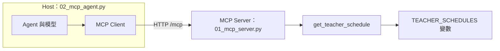
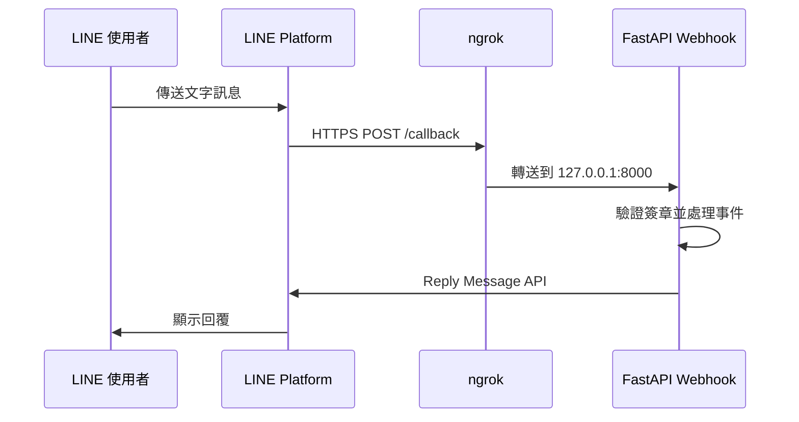
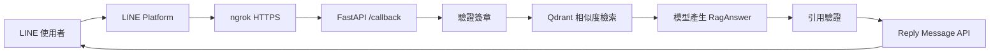

# Day 3 學員講義：HTTP MCP 與 PDF RAG LINE Bot

前兩天完成了兩組基礎能力。Day 1 負責模型呼叫、Prompt、Structured Output 與多模態；Day 2 負責文件載入、向量檢索、RAG 與 Agent。Day 3 將其中兩項能力接到外部系統：上午用 HTTP 發布 MCP Tool，下午用 ngrok 把 PDF RAG 接到真實 LINE Messaging API。

今天有兩個獨立成果，不把所有元件塞進同一支程式：

1. **HTTP MCP 老師課表**：Agent 透過 MCP Tool 查詢虛構老師課表。
2. **PDF RAG LINE Bot**：LINE 使用者詢問《教育人員任用條例》，程式檢索 PDF 後附來源回答。

這樣安排有一個直接好處。MCP 連線失敗時，只查 MCP Server 與 Client；LINE 回覆失敗時，只查 Webhook、ngrok 與 PDF RAG。兩條路徑互不干擾。

`campus_data.py` 的老師與課表都是虛構資料。《教育人員任用條例》是公開法規，課程輸出只用於 RAG 技術展示，不作為法律或人事決策依據。API Key、LINE 憑證與 ngrok Auth Token 都是機密資料，只能保存在本機設定中。

## 課程大綱

1. 第一單元：MCP 的角色與 HTTP 連線。範例：`01`、`02`。
2. 第二單元：用 Python 變數製作老師課表 MCP Tool。範例：`01`、`02`。
3. 第三單元：LINE Webhook、簽章與 ngrok。範例：`04`。
4. 第四單元：把 Day 2 PDF RAG 接到 LINE。範例：`pdf_rag.py`、`05`。
5. 第五單元：成果展示與三天回顧。

## 開始前的設定

課程使用 Python 3.11 至 3.13。第一次進入 `day3` 資料夾後執行：

```powershell
uv sync
Copy-Item .env.example .env
```

`.env` 的模型與 Embedding 欄位可沿用 Day 2。LINE 主線還需要兩個真實憑證：

```dotenv
LINE_CHANNEL_SECRET=replace-with-your-line-channel-secret
LINE_CHANNEL_ACCESS_TOKEN=replace-with-your-line-channel-access-token
```

Channel Secret 用於驗證 Webhook 簽章，Channel Access Token 用於呼叫 Reply Message API。兩者用途不同，不可互換。

今天多次需要同時開兩個終端機：

- MCP：一個執行 HTTP Server，一個執行 Agent Client。
- LINE：一個執行 FastAPI Webhook，一個執行 ngrok。

服務型程式啟動後會持續執行。需要停止時，回到對應終端機按 `Ctrl+C`。

---

# 第一單元：MCP 與 HTTP 連線

**範例：`01_mcp_server.py`、`02_mcp_agent.py`**

## 1.1 工具逐一整合的成本

Day 2 已經看過 LangChain Tool 的四個部分：名稱、用途說明、輸入 Schema 與實際函式。若工具只放在某一支應用程式內，其他應用程式要使用同一份能力時，通常還要再做一次整合。

假設學校有 N 個應用程式與 M 種資料來源，逐一客製最多會出現 N×M 組連接。MCP（Model Context Protocol，模型上下文協定）提供標準連接方式，讓應用端與工具端分別實作一次，整合數量可收斂為 N+M。[1][2]

本課的例子是老師課表。`01_mcp_server.py` 發布課表查詢 Tool，`02_mcp_agent.py` 不知道課表存在哪裡，只知道如何透過 MCP 取得並呼叫 Tool。

## 1.2 Host、Client 與 Server

MCP 連線包含三個角色：

- **Host**：使用模型與工具的主應用，本課是 `02_mcp_agent.py`。
- **Client**：Host 內負責連接 MCP Server 的元件，本課使用 `MultiServerMCPClient`。
- **Server**：發布 Tools、Resources 或 Prompts 的服務，本課是 `01_mcp_server.py`。



本課只使用 **Tools**。Resources 與 Prompts 是 MCP Server 也能發布的內容，但不在今天的實作範圍內。[2]

## 1.3 為什麼只使用 HTTP

FastMCP 的 HTTP 傳輸會把 MCP Server 變成可透過 URL 存取的網路服務。與由 Client 啟動子行程的做法相比，HTTP 模式的 Server 生命週期更容易觀察：先啟動服務，再從另一個終端機連線。[3]

本課固定使用：

```text
http://127.0.0.1:8765/mcp
```

`127.0.0.1` 代表只有本機能連接，`8765` 是服務埠，`/mcp` 是 FastMCP 的 MCP 端點。

【小提醒】本課的 MCP Server 沒有驗證機制，因此只監聽本機。若改成對外服務，必須另外設計身分驗證、授權、TLS 與網路限制。

## 1.4 第一次啟動與連線

開啟兩個終端機。

```powershell
# 終端機 A：啟動 MCP Server
uv run examples/01_mcp_server.py
```

終端機 A 會停在執行狀態，代表 Server 正在等待連線。接著執行：

```powershell
# 終端機 B：連線、列出 Tool、詢問課表
uv run examples/02_mcp_agent.py `
  --show-tools `
  --question "請查王老師的課表"
```

預期看到三類輸出：

1. 工具清單只有 `get_teacher_schedule`。
2. 工具執行結果包含王怡婷與王志明兩位老師。
3. 模型整理後的繁體中文回答。

這裡的「王」是關鍵字，不是完整姓名。工具必須回傳所有姓名包含「王」的結果，不能自行挑一位。

再測查無資料：

```powershell
uv run examples/02_mcp_agent.py --question "請查陳大華老師的課表"
```

工具應回傳「查無姓名包含『陳大華』的老師課表」，模型也應如實轉達。

## 1.5 連線失敗如何判斷

若終端機 B 出現連線錯誤，先看終端機 A。最常見的原因只有三個：

1. `01_mcp_server.py` 尚未啟動。
2. 8765 埠已被其他程式占用。
3. Client 的 URL 與 Server 埠不一致。

先確認 `http://127.0.0.1:8765/mcp`，再檢查其他設定。這比一開始就修改 Agent Prompt 有效，因為 Prompt 無法修復網路連線。

---

# 第二單元：老師課表 MCP Tool

**範例：`campus_data.py`、`01_mcp_server.py`、`02_mcp_agent.py`**

## 2.1 資料來源只是一個 Python 變數

`campus_data.py` 沒有資料庫。課表直接放在 `TEACHER_SCHEDULES`：

```python
TEACHER_SCHEDULES: dict[str, tuple[str, ...]] = {
    "王怡婷": (
        "星期一：第 1 節五年一班國語、第 3 節五年二班國語",
        "星期二：第 2 節五年一班國語、第 5 節閱讀社團",
    ),
    "王志明": (
        "星期一：第 2 節五年一班數學、第 5 節五年二班數學",
    ),
}
```

這種設計不適合正式校務系統，但很適合教學。學員可以直接看見輸入、查詢與輸出的關係，不必先處理資料庫連線、帳號與 SQL。

## 2.2 關鍵字查詢

查詢函式只有一個參數：

```python
def query_teacher_schedule(teacher_name: str) -> str:
    keyword = teacher_name.strip()
    if not keyword:
        return "請輸入老師姓名或部分姓名，例如：王、怡婷、林美玲。"

    matches = [
        (name, schedule)
        for name, schedule in TEACHER_SCHEDULES.items()
        if keyword in name
    ]
```

`keyword in name` 是字面包含比對：

| 輸入     | 可能結果         |
| -------- | ---------------- |
| `王怡婷` | 只找到王怡婷     |
| `怡婷`   | 只找到王怡婷     |
| `王`     | 找到所有王姓老師 |
| `陳大華` | 查無資料         |
| 空字串   | 提醒輸入姓名     |

本課不做模糊比對。「王志民」不會自動修正成「王志明」。模糊比對會引入相似度門檻與誤配問題，已超出這個範例要教的重點。

## 2.3 用 FastMCP 發布 Tool

`01_mcp_server.py` 的核心只有幾行：

```python
mcp = FastMCP("teacher-schedule")


@mcp.tool
def get_teacher_schedule(teacher_name: str) -> str:
    """依老師姓名關鍵字查詢一週課表。可輸入全名或部分姓名，例如「王」或「王怡婷」。"""
    return query_teacher_schedule(teacher_name)
```

FastMCP 會從函式取得 Tool 的四項資料：

| Tool 要素   | 程式來源               |
| ----------- | ---------------------- |
| 名稱        | `get_teacher_schedule` |
| 用途說明    | docstring              |
| 輸入 Schema | `teacher_name: str`    |
| 實際行為    | 函式本體               |

Server 固定以 HTTP 啟動：

```python
mcp.run(transport="http", host="127.0.0.1", port=8765)
```

修改 Server 或 `campus_data.py` 後，要停止並重新啟動終端機 A。HTTP Server 不會自動載入剛儲存的新程式碼。

## 2.4 Client 不包含課表工具定義

`02_mcp_agent.py` 的連線設定如下：

```python
client = MultiServerMCPClient(
    {
        "teacher-schedule": {
            "url": "http://127.0.0.1:8765/mcp",
            "transport": "http",
        }
    }
)
tools = await client.get_tools()
```

`get_tools()` 會向 Server 讀取 Tool 定義，再轉成 LangChain Tool。[4] `02_mcp_agent.py` 裡沒有 `get_teacher_schedule()`，也沒有 `TEACHER_SCHEDULES`。這正是 MCP 分離工具提供端與使用端的效果。

## 2.5 錯誤訊息也是工具輸出

查無老師或輸入空白時，查詢函式回傳可讀訊息，而不是拋出例外。原因很實際：Tool 的結果會交給模型閱讀。明確的「查無資料」能讓模型停止猜測，Python 錯誤堆疊則很難轉成合適的使用者回答。

這不代表所有錯誤都應吞掉。程式設定錯誤、網路中斷或資料損壞仍應記錄例外；只有可預期的使用者輸入問題適合轉成明確的工具結果。

## 2.6 動手修改

### 練習 A：加入一位老師

**時間：8 分鐘｜修改 `campus_data.py`**

在 `TEACHER_SCHEDULES` 加入一位虛構老師。重新啟動 MCP Server，分別以完整姓名與姓氏查詢。

檢查點：完整姓名只回傳一位；姓氏若符合多人，應回傳全部結果。

### 練習 B：調整 Tool 說明

**時間：10 分鐘｜修改 `01_mcp_server.py`**

先把 docstring 改成模糊的「查詢資料」，觀察模型是否仍會選對 Tool；再改回包含「老師、姓名關鍵字、一週課表」的說明，比較工具選擇結果。

檢查點：`--show-tools` 顯示的 description 會跟著 docstring 改變。

### 練習 C：先測資料函式

**時間：8 分鐘｜不呼叫模型**

```powershell
uv run pytest -q tests/test_campus_data.py
```

看到 `6 passed` 代表關鍵字查詢的基本契約成立。若這一層失敗，先修資料函式，不必啟動 MCP 或模型。

---

# 第三單元：LINE Webhook 與 ngrok

**範例：`04_line_echo.py`、`line_utils.py`**

## 3.1 Webhook 改變呼叫方向

前兩天大多是我們的程式主動呼叫模型 API。Webhook 的方向相反：使用者傳訊息給 LINE Official Account，LINE Platform 再對我們註冊的網址送出 HTTPS POST。[5]



FastAPI 只在本機 `127.0.0.1:8000` 執行，LINE Platform 無法直接連入。ngrok 提供公開 HTTPS URL，並把流量轉送到本機服務。[7]

ngrok 適合開發與展示，不是正式部署方案。關閉本機程式或 ngrok 後，Webhook 就無法使用。

## 3.2 事件、Reply Token 與簽章

LINE Webhook 的 request body 是 JSON，其中可以包含多個事件。本課只處理 `message` 事件中的文字訊息。

每個可回覆事件會帶有 Reply Token。程式用它呼叫 Reply Message API；Token 只能使用一次，而且應盡快使用。[5]

公開 Webhook 也會收到非 LINE 來源的請求，因此必須驗證 `X-Line-Signature`。LINE Platform 使用 Channel Secret 與原始 request body 計算 HMAC-SHA256；Webhook 用相同方式重算，兩者一致才處理。[6]

順序不能交換：

```text
讀取 raw body → 驗證簽章 → 解析 JSON → 處理事件 → 回覆
```

如果先把 JSON 解析後重新序列化，空白、跳脫字元或換行可能改變，簽章驗證就會失敗。官方文件明確要求以收到的原始內容驗證。[6]

## 3.3 準備 LINE Messaging API Channel

開始前需要：

1. LINE 帳號。
2. LINE Official Account。
3. 對應的 Messaging API Channel。
4. Channel Secret。
5. Channel Access Token。

把最後兩項填入 `.env`。若 LINE Official Account Manager 啟用了預設 Auto-reply，建議先關閉，否則測試時可能同時收到平台自動回覆與程式回覆。[5]

## 3.4 安裝 ngrok

Windows 可從 Microsoft Store 安裝，也可依 ngrok 官方 Windows 下載頁提供的方式安裝。[7]

確認指令可用：

```powershell
ngrok help
```

登入 ngrok Dashboard 取得 Auth Token，執行一次：

```powershell
ngrok config add-authtoken "<YOUR_AUTHTOKEN>"
```

終端機顯示設定成功後即可使用。Auth Token 不要放在 `.env.example`、作業或截圖中。

## 3.5 啟動 Echo Bot

開啟兩個終端機：

```powershell
# 終端機 A：啟動 FastAPI
uv run examples/04_line_echo.py

# 終端機 B：把公開 HTTPS 流量轉到本機 8000 埠
ngrok http 8000
```

ngrok 會顯示 HTTPS Forwarding URL，例如：

```text
https://example.ngrok.app
```

在 LINE Developers Console 的 Messaging API 頁籤完成設定：

1. Webhook URL 填入 `https://example.ngrok.app/callback`。
2. 按 **Verify**。
3. 確認顯示成功。
4. 啟用 **Use webhook**。
5. 將 Official Account 加為好友。

從手機傳送「你好」，應收到：

```text
你說的是：你好
```

終端機 A 同時會印出 `[收到訊息] 你好`。這表示 LINE Platform、ngrok、簽章驗證、FastAPI 與 Reply Message API 都已接通。

【小提醒】重新啟動 ngrok 時，以畫面當下顯示的 HTTPS URL 為準。若 URL 與 LINE Developers Console 中的設定不同，請更新後重新 Verify。

## 3.6 讀懂 Echo Webhook

核心流程如下：

```python
@app.post("/callback")
async def callback(request: Request, x_line_signature: str = Header(default="")) -> dict:
    body = await request.body()
    if not verify_signature(CHANNEL_SECRET, body, x_line_signature):
        raise HTTPException(status_code=403, detail="簽章驗證失敗")

    payload = json.loads(body)
    for event in payload.get("events", []):
        ...
        send_text_reply(
            CHANNEL_ACCESS_TOKEN,
            event["replyToken"],
            f"你說的是：{message['text']}",
        )
    return {"status": "ok"}
```

LINE Platform 的 Webhook Verify 可能送出沒有訊息事件的 payload。`events` 為空時，for 迴圈不執行，端點仍回傳成功狀態，這是正常行為。

## 3.7 備援模擬器

`06_simulate_line.py` 保留給無法申請 LINE Channel 或無法使用 ngrok 的環境，不是課堂主流程。它使用 `.env` 的 Channel Secret 產生簽章，並把事件送到本機 Webhook。

```powershell
uv run examples/06_simulate_line.py --text "你好"
uv run examples/06_simulate_line.py --text "你好" --bad-signature
```

第二條指令應得到 403，可用來確認簽章防線存在。模擬器不會真正呼叫 LINE API，回覆只印在 Webhook 終端機。

---

# 第四單元：PDF RAG LINE Bot

**範例：`pdf_rag.py`、`05_pdf_rag_linebot.py`**

## 4.1 從 Day 2 搬來什麼

Day 2 的 `03a_pdf_rag.py` 已經走過完整流程：

```text
PDF → 每頁 Document → Chunk → Embedding → Qdrant
    → 相似度檢索 → Structured Output → 引用驗證
```

Day 3 沒有修改 Day 2 程式，而是在自己的資料夾建立 `pdf_rag.py`、`schemas.py`，並複製一份《教育人員任用條例》PDF。這讓 Day 3 可以獨立執行，也保留 Day 2 原本的學習成果。

新的 LINE Bot 不使用 Agent，也不呼叫 MCP。每一個文字問題固定走 PDF RAG，流程較容易觀察：



## 4.2 PDF 載入、切分與 Metadata

`load_pdf_pages()` 使用 `pypdf` 讀取 PDF，每頁轉成一個 `Document`，並保留：

- `source`：`data/教育人員任用條例.pdf`
- `title`：教育人員任用條例
- `page`：PDF 頁碼

`split_pdf_pages()` 再把每頁切成 Chunk，預設 `chunk_size=700`、`chunk_overlap=100`。每個 Chunk 會得到可讀的 ID，例如：

```text
教育人員任用條例-p003-c02
```

頁碼與 chunk ID 不是裝飾。回答附來源時，程式需要靠它們回查本次檢索到的原文。

## 4.3 Qdrant 建庫

`build_pdf_vector_store()` 會重建 `.qdrant_pdf/`：

1. 載入 9 頁 PDF。
2. 切分成多個 Chunk。
3. 以目前模型供應商的 Embedding 產生向量。
4. 建立 Qdrant Collection。
5. 寫入 Chunk 與 Metadata。

先單獨執行：

```powershell
uv run examples/pdf_rag.py `
  --question "教育人員的任用應注意哪些條件？"
```

預期輸出包含 PDF 名稱、頁數、Chunk 數、回答與來源。這一步成功後再接 LINE，可避免把 PDF 問題誤判成 Webhook 問題。

## 4.4 Structured Output 與引用驗證

模型必須回傳 `RagAnswer`：

```python
class RagAnswer(BaseModel):
    answer: str
    citations: list[Citation]
    insufficient_evidence: bool
```

每筆 `Citation` 包含 `source`、`chunk_id` 與原文短句 `quote`。`validate_citations()` 逐項檢查：

1. `chunk_id` 是否在本次檢索結果。
2. `source` 是否與 Metadata 相同。
3. `quote` 是否真的出現在該 Chunk 原文。
4. 宣稱證據足夠時，是否至少提供一筆引用。

只要其中一項失敗，LINE Bot 就不傳送模型原答案，而是回覆固定訊息：

```text
引用驗證未通過，暫不提供答案。請查閱法規原文或洽詢承辦單位。
```

這道檢查無法證明回答一定正確，但能阻止幾種明確的假引用。

## 4.5 啟動期與每次訊息

`05_pdf_rag_linebot.py` 使用 FastAPI lifespan。服務啟動時完成模型、Embedding 與 Qdrant 建庫：

```python
@asynccontextmanager
async def lifespan(app: FastAPI):
    provider = get_provider()
    MODEL = create_chat_model(provider)
    embeddings = create_embeddings(provider)
    VECTOR_STORE, QDRANT_CLIENT, chunks, page_count = build_pdf_vector_store(embeddings)
    yield
```

這些資源不需要每收到一則 LINE 訊息就重建。

每次問題則執行：

```python
result = await asyncio.wait_for(
    asyncio.to_thread(answer_pdf_question, MODEL, VECTOR_STORE, text),
    timeout=ANSWER_TIMEOUT_SECONDS,
)
```

Day 2 的 PDF RAG 是同步函式。`asyncio.to_thread()` 把它放到背景執行緒，避免同步模型呼叫直接卡住 FastAPI 的事件迴圈；`wait_for()` 則限制等待時間。

LINE 官方建議非同步處理 Webhook 事件，避免後續請求等待。[8] 本課為了保留 Reply Message 的直觀流程，仍在單次 Webhook 中等待 RAG 完成。正式服務若有較高流量或回答時間不穩定，應改用背景工作、事件去重與適合的訊息發送策略，這不在本課實作範圍內。

## 4.6 用同一個 ngrok URL 切換最終版

如果終端機 A 還在執行 `04_line_echo.py`，先按 `Ctrl+C`。保留終端機 B 的 ngrok，然後在終端機 A 執行：

```powershell
uv run examples/05_pdf_rag_linebot.py
```

兩支程式都使用 8000 埠與 `/callback`，因此 LINE Developers Console 的 Webhook URL 不必更改。

服務第一次啟動要呼叫 Embedding API 並建庫，需要等待幾秒。看到以下格式的訊息後再從手機提問：

```text
PDF RAG LINE Bot 已啟動（provider=gemini，PDF 9 頁，... 個 chunk）
```

## 4.7 三類測試問題

從手機依序測試：

```text
教育人員的任用應注意哪些條件？
教育人員可以兼任補習班負責人嗎？
這份法規有沒有規定學校午餐菜色？
```

觀察項目：

| 問題       | 預期觀察                        |
| ---------- | ------------------------------- |
| 任用條件   | 回答依據 PDF，附頁碼與 chunk ID |
| 兼任補習班 | 檢查是否找到相關條文並正確引用  |
| 午餐菜色   | PDF 無此資料，應說明證據不足    |

若第三題得到一份自行編出的菜單，代表 Grounding 失敗，不能視為成功。

## 4.8 雙模型比較

分別使用 `MODEL_PROVIDER=gemini` 與 `azure` 測試同樣三題。每次切換後重新啟動服務，讓程式用對應的 Embedding 重建 `.qdrant_pdf/`。

| 問題       | Gemini：答案／引用／延遲 | Azure：答案／引用／延遲 |
| ---------- | ------------------------ | ----------------------- |
| 任用條件   |                          |                         |
| 兼任補習班 |                          |                         |
| 午餐菜色   |                          |                         |

比較時不要只看文句流暢度。引用是否能通過驗證、資料不足時是否拒答，對 RAG 更重要。

## 4.9 修改練習

以下選一項，完成後重新以手機測試：

1. **回覆格式**：修改 `format_line_answer()`，將回答固定成「結論、來源、提醒」三段。
2. **檢索數量**：把 `answer_pdf_question()` 的 `k` 從 4 改成 2 或 6，比較引用與回答差異。
3. **逾時實驗**：暫時把 `ANSWER_TIMEOUT_SECONDS` 改成 1，觀察固定逾時訊息，再改回 25。
4. **更換 PDF**：換成另一份可擷取文字的公開文件，並同步修改標題、Collection 名稱與免責提醒。

---

# 發生錯誤時

建議依序從最小範圍檢查，不要同時修改多個層次。

## 1. 設定層

- `.env` 是否存在。
- `MODEL_PROVIDER` 是否為 `gemini` 或 `azure`。
- 對應的模型與 Embedding 欄位是否完整。
- LINE Channel Secret 與 Channel Access Token 是否來自同一個 Channel。
- 修改 `.env` 後是否重新啟動服務。

## 2. MCP 資料層

```powershell
uv run pytest -q tests/test_campus_data.py
```

若失敗，先修 `campus_data.py`。這一步不需要 MCP Server 或模型。

## 3. MCP 連線層

- 終端機 A 是否正在執行 `01_mcp_server.py`。
- Client URL 是否為 `http://127.0.0.1:8765/mcp`。
- 8765 埠是否被其他程式使用。
- 修改 Server 後是否重新啟動。

## 4. PDF 層

```powershell
uv run pytest -q tests/test_pdf_rag.py
```

若顯示「PDF 沒有可擷取的文字」，檔案可能是掃描影像，需要先做 OCR。若切換 Embedding 後出現向量維度問題，刪除 `.qdrant_pdf/` 再重新建庫。

## 5. ngrok 層

- FastAPI 是否正在 8000 埠執行。
- `ngrok http 8000` 是否仍在執行。
- LINE Developers Console 的 URL 是否為目前 ngrok HTTPS URL 加 `/callback`。
- URL 是否按過 Verify，並啟用 Use webhook。

## 6. LINE 層

- 403：簽章不符，檢查 Channel Secret 與 raw body 驗證順序。
- 401：通常是 Channel Access Token 不正確或失效。
- 收到兩份回答：檢查 LINE Official Account Manager 的 Auto-reply。
- Verify 成功但手機沒回覆：檢查 Use webhook、好友狀態與終端機 A 的錯誤紀錄。

## 7. 模型與 RAG 層

- 429：模型配額或速率限制。
- 逾時：模型或 Embedding 回應過慢。
- 引用驗證未通過：查看終端機列出的 citation issue，不要直接關掉驗證。
- 證據不足：先檢查檢索 Chunk，再判斷是問題問法、Chunk 設定或 PDF 本身沒有資料。

---
