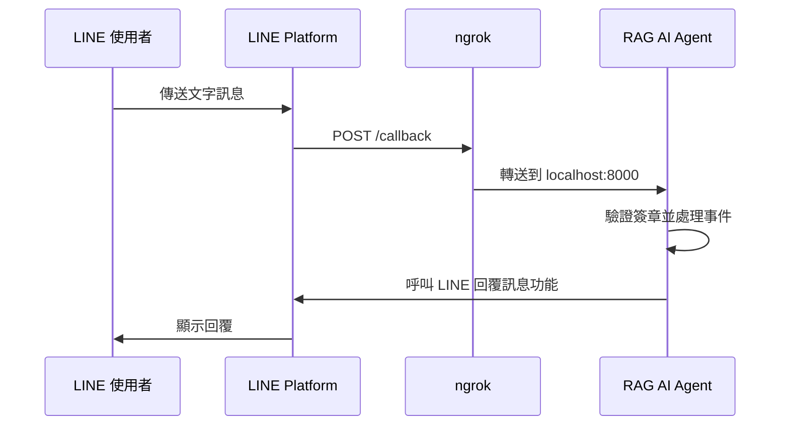
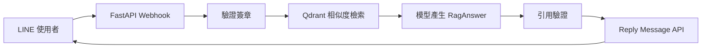
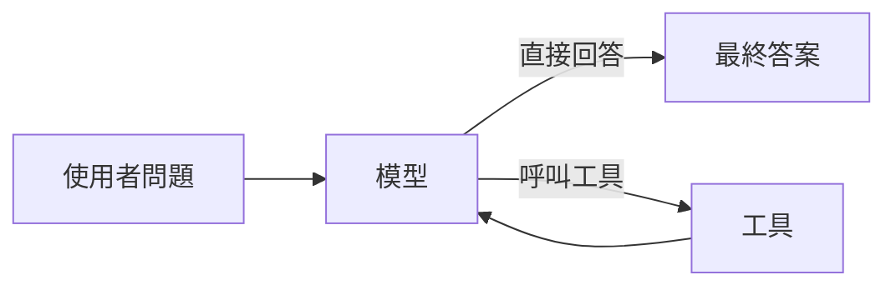
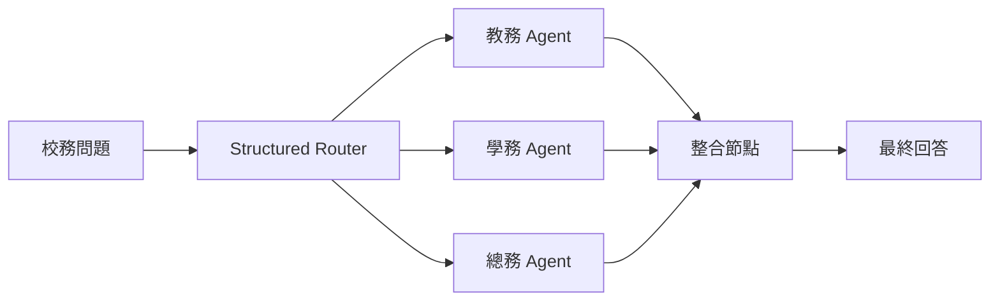
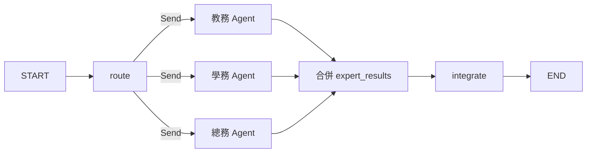

# Day 3 RAG LINE Bot、Agent、LangGraph 與 Ollama

前兩天的範例主要由程式決定執行順序。Day 3 先把 RAG（先找資料，再根據資料回答）接到 LINE Webhook（由 LINE 主動通知我們有新訊息）。接著把「選擇工具與下一步」交給 Agent，亦即能根據問題決定行動的模型程式。最後使用 LangGraph，以節點和連線描述多位 Agent 的協作流程，並透過 Ollama 在自己的電腦執行模型。


> 【小提醒】`campus_data.py` 的姓名、課表、場地與流程均為虛構資料。《教育人員任用條例》PDF 用於 RAG 技術展示，不作為法律或人事決策依據。課堂操作請勿輸入學生個資或未公開校務資訊。

## 課程大綱

| 單元 | 主題                              | 主要成果                           |
| ---- | --------------------------------- | ---------------------------------- |
| 一   | LINE Webhook 與公開轉送工具 ngrok | 從手機傳送訊息並收到原樣回覆       |
| 二   | PDF RAG LINE Bot                  | 透過 LINE 查詢 PDF，回答附來源     |
| 三   | Single-Agent                      | 由一位 Agent 自行選擇校園工具      |
| 四   | LangGraph Multi-Agent             | 依領域分派給教務、學務、總務 Agent |
| 五   | Ollama 本地模型                   | 不使用雲端模型 API 整理校務通知    |

---

## 開始前的設定

進入 `day3` 後安裝相依套件，並建立本機設定檔：

```powershell
uv sync
Copy-Item .env.example .env
```

macOS 或 Linux：

```bash
uv sync
cp .env.example .env
```

先選擇雲端模型供應商：

```dotenv
MODEL_PROVIDER=gemini
```

可用值為 `gemini` 或 `azure`。請依選擇填入 `.env` 對應欄位。第一、二單元另需設定 LINE 憑證：Channel Secret 是驗證 LINE 請求的密鑰，Channel Access Token 是程式呼叫 LINE 回覆功能的存取憑證。兩者的取得方式會在 1.3 節操作。

```dotenv
LINE_CHANNEL_SECRET=replace-with-your-line-channel-secret
LINE_CHANNEL_ACCESS_TOKEN=replace-with-your-line-channel-access-token
```

第五單元使用：

```dotenv
OLLAMA_MODEL=gpt-oss:20b
OLLAMA_BASE_URL=http://localhost:11434
```

完成後先執行不需要模型 API 的測試：

```powershell
uv run pytest -q
```

預期所有測試通過。若此時失敗，先修正本機環境或檔案問題，不要急著設定 LINE Webhook。

---

# 第一單元：LINE Webhook 與 ngrok

**範例：`01_line_echo.py`、`line_utils.py`**

本單元先完成 Echo Bot，也就是收到使用者文字後原樣回覆的機器人。確認 LINE 串接正常後，第二單元再換成 RAG 回答。

## 1.1 Webhook 改變呼叫方向

一般的命令列程式由使用者主動執行。Webhook 則相反：我們先提供一個網址，事件發生時再由外部服務主動呼叫這個網址。

網路服務依照 HTTP 通訊規則交換資料；URL 就是服務的網址，POST 則是把資料送到服務的一種 HTTP 方法。LINE Platform 收到訊息後，會對我們提供的 URL 發出 HTTP POST。這個網址使用 HTTPS，代表傳輸過程經過加密保護。

本機網址無法直接讓 LINE Platform 連入，因此課堂使用 ngrok。ngrok 是一項公開轉送工具：它提供臨時的 HTTPS 網址，再把收到的請求轉送到本機的 8000 埠。



這段流程有兩個不同方向：

- Webhook：LINE Platform 呼叫我們的 `/callback`。
- Reply Message API：API 是程式呼叫外部服務功能的介面；我們使用 Channel Access Token 呼叫 LINE 的回覆訊息功能。Reply message 只能回覆目前的 Webhook 事件，不能用來主動發送訊息。

把兩者混在一起，常會出現「Webhook Verify 成功，但手機沒有回覆」的情況。

## 1.2 簽章驗證不能省略

LINE 在每次 Webhook 請求的 `X-Line-Signature` 標頭放入簽章；標頭是隨請求附上的補充資料。簽章可理解為依「訊息內容」與「只有 LINE 和我們的伺服器知道的秘密值」算出的驗證碼，用來檢查請求來源及內容是否在途中被改動。這個秘密值的正式名稱是密鑰。

這段驗證涉及三個名詞：

- **Channel Secret**：LINE Channel 與我們的伺服器共同持有的密鑰。
- **HMAC-SHA256**：使用密鑰與訊息內容計算驗證碼的方法。
- **Base64**：把計算結果轉成可放進 HTTP 標頭的文字格式。

伺服器要使用 Channel Secret 對原始 request body，也就是 LINE 實際送來、尚未解析的原始位元組，計算 HMAC-SHA256，再做 Base64 編碼並比較結果。

`line_utils.py` 將這段邏輯拆成兩個函式：

```python
def compute_signature(channel_secret: str, body: bytes) -> str:
    digest = hmac.new(channel_secret.encode("utf-8"), body, hashlib.sha256).digest()
    return base64.b64encode(digest).decode("utf-8")


def verify_signature(channel_secret: str, body: bytes, signature: str) -> bool:
    expected = compute_signature(channel_secret, body)
    return hmac.compare_digest(expected, signature)
```

必須先取得原始位元組再驗證。若先把 JSON 解析後重新序列化，空白、換行或欄位順序都可能改變，簽章就不再對應同一份內容。

## 1.3 準備 LINE Channel

在 LINE Developers Console 建立或選取 Messaging API Channel；Channel 是集中管理這個 LINE Bot 憑證與 Messaging API 設定的空間：

- **Channel Secret** 用於驗證 Webhook 簽章，不能拿來呼叫 LINE API。
- **Channel Access Token** 是程式呼叫 Reply Message API 時使用的存取憑證。

1. 取得 Channel Secret。
2. 發行 Channel Access Token。
3. 將兩者填入 `.env`。
4. 將 LINE Official Account 加為好友。
5. 在 LINE Official Account Manager 關閉預設 Auto-reply。

Channel Secret 與 Channel Access Token 必須來自同一個 Channel。設定後不要把 `.env` 顯示在投影畫面。

## 1.4 啟動 Echo Bot

安裝 ngrok 後先確認指令可用：

```powershell
ngrok help
```

若尚未綁定帳號，從 ngrok Dashboard 取得 Auth Token，只在自己的電腦執行一次：

```powershell
ngrok config add-authtoken "<YOUR_AUTHTOKEN>"
```

開啟兩個終端機：

```powershell
# 終端機 A
uv run examples/01_line_echo.py

# 終端機 B
ngrok http 8000
```

終端機 A 應顯示 FastAPI 正在 `127.0.0.1:8000` 執行。FastAPI 是用 Python 建立 HTTP API 的 Web 框架，本例用它接收 LINE 的 `/callback` 請求。終端機 B 會顯示類似下列 URL：

```text
https://example.ngrok.app
```

在 LINE Developers Console 的 Webhook URL 填入：

```text
https://example.ngrok.app/callback
```

按 **Verify**，確認成功後啟用 **Use webhook**。從手機傳送「你好」，預期收到：

```text
你說的是：你好
```

若 Verify 失敗，依序檢查 FastAPI、ngrok、URL 的 `/callback` 與 Channel Secret。先不要加入模型，否則錯誤範圍會一次擴大到 Webhook、模型與資料三層。

## 1.5 讀懂 Echo Webhook

`01_line_echo.py` 只處理文字訊息：

```python
@app.post("/callback")
async def callback(request: Request, x_line_signature: str = Header(default="")) -> dict:
    body = await request.body()
    if not verify_signature(CHANNEL_SECRET, body, x_line_signature):
        raise HTTPException(status_code=403, detail="簽章驗證失敗")

    payload = json.loads(body)
    for event in payload.get("events", []):
        if event.get("type") != "message":
            continue
```

LINE 的 Webhook Verify 可能送出沒有訊息事件的 payload。此時 `events` 為空，for 迴圈不執行，端點仍回傳成功。這不是漏接訊息。

---

# 第二單元：RAG LINE Bot

**範例：`02_build_pdf_qdrant.py`、`02a_pdf_rag.py`、`02b_pdf_rag_linebot.py`**

**共用模組：`pdf_rag.py`、`schemas.py`**

## 2.1 先保留固定流程

這一單元還不使用 Agent。每個文字問題都固定執行同一條 RAG 管線；這裡的「管線」就是一連串順序固定的處理步驟。

先用白話讀一次：程式把問題轉成可比較的數字表示，找出內容最接近的 PDF 片段，把這些片段連同問題交給模型，再檢查模型提供的引用。

接著對照正式名稱：

- **向量檢索**：把問題與文件片段轉成向量後，比較哪些片段最相近。
- **Context（參考脈絡）**：本次找到並提供給模型的文件片段。
- **Structured Output（結構化輸出）**：要求模型依固定欄位回傳資料，而非只回傳一段自由文字。
- **Qdrant**：本課用來保存文件向量並執行相似度搜尋的向量資料庫。

```text
問題 → 向量檢索 → 組合 Context → Structured Output
    → 引用驗證 → LINE 回覆
```

固定流程的優點是容易預測與測試。只要每個問題都應查詢同一份 PDF，就沒有必要讓模型決定是否檢索。



## 2.2 PDF、Chunk 與 Metadata

長文件不適合整份直接拿去搜尋，因此程式會把文字切成較小片段。每個片段稱為 **Chunk（文件片段）**；描述片段來源、頁碼等附加資訊的欄位則稱為 **Metadata（中繼資料）**。

`load_pdf_pages()` 使用 `pypdf` 擷取每頁文字，再建立 LangChain `Document`。`Document` 是把「文字內容」和「Metadata」放在一起的資料物件。每頁保留：

- `source`：PDF 路徑。
- `title`：文件名稱。
- `page`：PDF 頁碼。

`split_pdf_pages()` 以 `RecursiveCharacterTextSplitter` 切分文字，並加入可讀的 `chunk_id`：

```text
教育人員任用條例-p003-c02
```

回答附來源時，程式要靠 `source`、`page` 與 `chunk_id` 回查本次檢索內容。Metadata 因此是驗證資料，不只是顯示文字。

## 2.3 先建立 PDF 向量資料庫

模型不能直接以數學方式比較兩段文字是否相似，因此要先用 **Embedding Model（嵌入模型）** 把文字轉成一串數字，也就是向量。建庫就是把 PDF 載入、切成 Chunk、計算每個 Chunk 的向量，再寫入本機 Qdrant：

```powershell
uv run examples/02_build_pdf_qdrant.py --provider azure
```

程式會重建 `.qdrant_pdf/`，預期輸出包括：

- PDF 名稱與頁數。
- Chunk 數量。
- 向量資料庫路徑。

只有更換 PDF、Chunk 設定或 Embedding Model 時才需要重新執行建庫。Qdrant Client 是 Python 程式連接 Qdrant 的用戶端物件；建庫完成後，程式會將它關閉，不會持續占用資料庫。

## 2.4 在命令列驗證 RAG

不要一開始就從手機測試。先開啟既有向量資料庫執行問答：

```powershell
uv run examples/02a_pdf_rag.py --provider azure --question "教育人員的任用應注意哪些條件？"
```

預期輸出回答、PDF 頁碼與 chunk ID。若這一步失敗，問題位於 Embedding、Qdrant、檢索或模型設定，和 LINE 無關。建庫與查詢必須使用相同的 Embedding Model；切換供應商或 Embedding Model 後要重新建庫。

## 2.5 Structured Output 與引用驗證

前面提到的 Structured Output 在這裡由 `RagAnswer` 定義。它像一張固定格式的回答表單，要求模型分別填入答案、引用與「證據是否不足」：

```python
class RagAnswer(BaseModel):
    answer: str
    citations: list[Citation]
    insufficient_evidence: bool
```

每筆引用包含 `source`、`chunk_id` 與原文短句 `quote`。`validate_citations()` 會檢查：

1. `chunk_id` 是否存在於本次檢索結果。
2. `source` 是否等於 Document Metadata。
3. `quote` 是否真的出現在 Chunk 原文。
4. 模型宣稱證據足夠時，是否至少提供一筆引用。

這些檢查不能證明回答必然正確，但能攔下不存在的 chunk、錯誤來源與偽造原文。驗證失敗時，LINE Bot 回傳固定訊息，不傳送模型原答案。

## 2.6 啟動期只開啟既有向量庫

某些資源只需在服務啟動時建立一次，關閉服務時再統一釋放。FastAPI 將這段從啟動到關閉的生命週期管理機制稱為 **lifespan**。`02b_pdf_rag_linebot.py` 使用 lifespan 建立模型與 Embedding Client，再開啟既有 Qdrant：

```python
@asynccontextmanager
async def lifespan(app: FastAPI):
    provider = get_provider()
    MODEL = create_chat_model(provider)
    embeddings = create_embeddings(provider)
    VECTOR_STORE, QDRANT_CLIENT = open_pdf_vector_store(embeddings)
    yield
```

LINE Bot 不會在啟動時重新讀取 PDF、切分文件或寫入 Chunk 向量。每則問題仍要產生一個查詢向量，才能進行相似度檢索，但不會重新計算整份 PDF。FastAPI lifespan 適合管理應用啟動與結束時使用的共享資源。[9]

每次收到問題時，程式以 `asyncio.to_thread()` 執行同步 RAG 函式，並用 `wait_for()` 限制等待時間。這是課程展示用的簡化處理。正式服務還要考慮事件去重、背景工作與失敗重試。

## 2.7 切換成 PDF RAG LINE Bot

在終端機 A 按 `Ctrl+C` 停止 Echo Bot。保留 ngrok，再執行：

```powershell
uv run examples/02b_pdf_rag_linebot.py --provider azure
```

兩支 Bot 都使用 8000 埠與 `/callback`，所以 LINE Developers Console 的 URL 不必更改。等終端機顯示「使用既有向量資料庫」後再提問。

測試三類問題：

| 問題                             | 預期觀察                 |
| -------------------------------- | ------------------------ |
| 教育人員的任用應注意哪些條件？   | 根據 PDF 回答並附來源    |
| 教育人員可以兼任補習班負責人嗎？ | 找到相關內容並引用原文   |
| 這份法規有沒有規定學校午餐菜色？ | 說明證據不足，不編寫菜單 |

---

# 第三單元：Single-Agent 校園行政助理

**範例：`campus_data.py`、`campus_tools.py`、`03_single_agent.py`**

## 3.1 Agent 和固定 Chain 的差別

固定 Chain（固定鏈）會按照程式預先排好的順序逐步執行；Agent 則讓模型根據目前問題與工具結果決定下一步。LangChain 的 Agent 會在「模型選擇行動 → 程式執行工具 → 模型讀取結果」的工具迴圈中執行，直到產生最終回答。

模型每一輪可以：

1. 直接回答。
2. 選擇一項或多項工具。
3. 讀取工具結果後再決定下一步。



Agent 並不代表所有流程都應交給模型。若每次都必須查同一份 PDF，第二單元的固定 RAG 更容易控制。當不同問題需要不同工具，或者一個問題可能組合多項工具時，Agent 才開始有明確價值。

> 【小知識】Agent 的狀態通常包含本次執行的訊息，但這不等於自動記得下一次執行。若要保存不同回合的狀態，需要設定 checkpointer（狀態檢查點保存器），並用 `thread_id`（對話識別碼）指出每次執行屬於哪一段對話。本單元只處理單次問題，因此不設定這兩項功能。

## 3.2 校園資料先做成純函式

`campus_data.py` 提供四種不需要模型的功能：

- `query_teacher_schedule()`：查詢虛構教師課表。
- `query_activity_procedure()`：查詢活動申請流程。
- `query_campus_venue()`：依人數與時段查詢場地。
- `calculate_activity_budget()`：試算交通、餐費與材料費。

先把資料查詢寫成純函式有兩個好處。第一，測試不必呼叫模型。第二，Single-Agent 與 Multi-Agent 可以使用同一份資料，架構比較才有意義。

## 3.3 工具說明會影響選擇

`campus_tools.py` 使用 `@tool` 包裝純函式：

```python
@tool
def search_campus_venue(expected_people: int, period: str = "") -> str:
    """依人數與時段查詢容量足夠的虛構校園場地。

    Args:
        expected_people: 預估使用場地的人數。
        period: 希望使用的時段，例如「星期五下午」；未指定時可留空。
    """
    return query_campus_venue(expected_people, period)
```

工具名稱、docstring、參數型別共同告訴模型何時使用工具以及如何填入參數。若兩項工具描述都只是「查詢資料」，模型很難穩定選擇。

## 3.4 使用 `create_agent()`

本專案採 LangChain 1.x 的 `create_agent()`：

```python
model = create_chat_model(args.provider)
agent = create_agent(
    model=model,
    tools=CAMPUS_TOOLS,
    system_prompt=SYSTEM_PROMPT,
    name="campus_single_agent",
)

result = agent.invoke(
    {"messages": [{"role": "user", "content": args.question}]},
    config={"recursion_limit": 12},
)
```

`SYSTEM_PROMPT` 明確限制：

System Prompt（系統提示）是程式在使用者問題之外，預先交給模型的角色與行為規則。這裡用它限制 Agent 必須依工具結果回答。

- 涉及校園資料時必須先使用工具。
- 不得自行補上工具沒有提供的資料。
- 複合問題可以呼叫多項工具。
- 所有資料只供課程展示。

程式會印出工具名稱與工具結果。這些是可觀測事件，不包含模型未公開的內部推理。

`recursion_limit` 是這次 Agent 執行最多允許的 Graph 步驟數，用來避免工具迴圈持續執行而無法結束；本例設為 12。

## 3.5 執行與觀察

執行預設綜合問題：

```powershell
uv run examples/03_single_agent.py --provider azure
```

預設問題同時涉及課表、場地與活動流程：

```text
王怡婷老師星期五下午想帶 60 人辦閱讀活動，
請確認她的課表、建議可用場地，並列出申請流程。
```

預期看到三類工具呼叫。接著逐題測試：

```powershell
uv run examples/03_single_agent.py --provider azure --question "請查王怡婷老師星期二的課表"
uv run examples/03_single_agent.py --provider azure --question "60 人星期五下午有哪些場地？"
uv run examples/03_single_agent.py --provider azure --question "校外教學 60 人，交通費 16000 元，每人餐費 80 元，總費用多少？"
```

觀察重點不是文字是否漂亮，而是：

- 是否選對工具。
- 是否把參數填入正確欄位。
- 複合問題是否漏掉工具。
- 工具回傳查無資料時，是否停止補寫。

## 3.6 Single-Agent 的界線

四項工具仍在可管理範圍內。如果工具增加到數十項，而且教務、學務、總務各有長篇規則，單一 Agent 每次都要看到大量不相關內容，選擇品質、延遲與維護成本可能開始惡化。

這時不要立刻增加更長的 System Prompt。先問三個問題：

1. 工具是否能合併或移除？
2. 問題是否其實適合固定 Workflow（工作流程），也就是由程式明確決定每一步？
3. 不同領域是否需要隔離輸入脈絡（Context）與工具，避免每位 Agent 都看到不相關資料？

第三題答案為是時，才進入 Multi-Agent。

---

# 第四單元：LangGraph Multi-Agent 校務協作

**範例：`04_multi_agent.py`**

## 4.1 為什麼不是所有問題都需要 Multi-Agent

Single-Agent 是一位 Agent 使用多項工具；Multi-Agent（多代理協作）則把工作分給多位職責不同的 Agent，再彙整結果。它的價值通常來自三類需求：隔離不同領域的輸入脈絡、讓不同團隊維護各自能力，或同時處理多個子任務。它也會增加模型呼叫、狀態管理與錯誤處理成本。

本單元採 Router（路由器）模式。Router 就像分診台：先判斷問題涉及哪些領域，再把問題分派給一位或多位專家，最後整合結果。這種模式適合一次性、可能跨領域的校務問題。

## 4.2 校園角色與工具邊界

| Agent      | 可見工具                                                | 負責範圍       |
| ---------- | ------------------------------------------------------- | -------------- |
| 教務 Agent | `search_teacher_schedule`                               | 教師課表       |
| 學務 Agent | `search_activity_procedure`、`estimate_activity_budget` | 活動流程與費用 |
| 總務 Agent | `search_campus_venue`                                   | 場地容量與時段 |

三位專家使用同一個模型，但 System Prompt 與工具不同。Multi-Agent 不要求每位 Agent 一定使用不同模型；真正的差異在於職責、輸入脈絡與可用工具的邊界。



## 4.3 State、Node 與 Edge

LangGraph 使用三項主要元件描述流程：

- **State**：流程執行期間，各節點共同讀取與更新的資料。
- **Node**：流程中的處理步驟，接收目前的 State，執行任務後回傳更新內容。
- **Edge**：定義節點之間的連接關係，決定流程接下來前往哪個節點。

本例的 State：

```python
class CampusState(TypedDict):
    question: str
    destinations: list[ExpertName]
    route_reason: str
    expert_results: Annotated[list[str], add]
    final_answer: str
```

多位專家會更新同一個 `expert_results` 欄位，因此要先指定「新結果如何與既有結果合併」。LangGraph 把這項欄位更新規則稱為 **reducer（合併規則）**。本例使用 `add` 串接清單，避免後完成的專家結果覆蓋先完成的結果。

## 4.4 結構化路由

Router 不能只回傳一段自由文字，否則程式還要猜測其中有哪些專家名稱。本例使用 Pydantic 定義資料格式；Pydantic 是 Python 的資料驗證函式庫，可以檢查欄位名稱、型別與限制。這份欄位規格稱為 Schema（資料結構規格）：

```python
ExpertName = Literal["teaching_affairs", "student_affairs", "general_affairs"]


class RouteDecision(BaseModel):
    destinations: list[ExpertName] = Field(min_length=1)
    reason: str
```

接著讓模型以 Structured Output 回傳：

```python
router = model.with_structured_output(RouteDecision)
decision = router.invoke(
    [
        ("system", "依問題選擇所需的校務專家。"),
        ("human", state["question"]),
    ]
)
```

這比解析「需要專家：teaching_affairs」之類的自由文字穩定。Pydantic 會依 Schema 限制可用名稱，程式也不必用 `if "teaching_affairs" in text` 猜測路由。

## 4.5 使用 `Send` 分派專家

Router 可能選出一位或多位專家，因此程式要依 `state["destinations"]` 的內容，為每位專家建立一張包含「目的節點」與「輸入資料」的派工單。LangGraph 將這種派工單物件稱為 `Send`；依 Router 結果產生不同數量的 `Send`，就是本例的動態分派：

```python
def dispatch_experts(state: CampusState) -> list[Send]:
    return [
        Send(destination, {"question": state["question"]})
        for destination in state["destinations"]
    ]
```

每個 `Send` 包含兩項資訊：

```text
Send(
    要前往的節點,
    傳給該節點的資料
)
```

例如：

```python
Send(
    "network_expert",
    {"question": "如何改善校園網路？"}
)
```

這表示執行 `network_expert` 節點，並把 `{"question": "如何改善校園網路？"}` 當成這次執行的輸入 State。

每位專家只收到原始問題與自己的 Prompt、工具，不需要讀取其他領域的完整資料。

## 4.6 整合節點

整合節點收到所有專家結果後，再呼叫模型整理：

```python
source_text = "\n\n".join(state["expert_results"])
response = model.invoke(
    [
        (
            "system",
            "只能整理專家結果，不可新增其中沒有的資料。",
        ),
        ("human", f"原始問題：{state['question']}\n\n專家結果：\n{source_text}"),
    ]
)
```

整合者的工作是組織文字，不是重新回答校務問題。若專家指出資料不足，整合者必須保留這項限制。

## 4.7 建構與編譯 Graph

組成一張完整的 LangGraph 流程圖
```python
builder = StateGraph(CampusState)
builder.add_node("route", route_node)
builder.add_node("teaching_affairs", teaching_node)
builder.add_node("student_affairs", student_node)
builder.add_node("general_affairs", general_node)
builder.add_node("integrate", integrate_node)

builder.add_edge(START, "route")
builder.add_conditional_edges("route", dispatch_experts)
builder.add_edge("teaching_affairs", "integrate")
builder.add_edge("student_affairs", "integrate")
builder.add_edge("general_affairs", "integrate")
builder.add_edge("integrate", END)

workflow = builder.compile()
```

這段程式分成三個階段：宣告 Graph 使用哪些節點、描述節點之間如何移動，最後編譯成可執行的 Workflow。建構期間不會呼叫模型，也不會執行任何 Agent。

### 4.7.1 建立 Graph 設計器

```python
builder = StateGraph(CampusState)
```

`builder` 是 Graph 的設計器，`CampusState` 則定義節點共用的資料欄位，代表這張圖執行期間使用的共用 State 結構是 `CampusState`。LangGraph 會分別保存與更新每個 State 欄位，官方把這種獨立傳遞資料的欄位稱為 **State channel（狀態通道）**：

```python
class CampusState(TypedDict):
    question: str
    destinations: list[ExpertName]
    route_reason: str
    expert_results: Annotated[list[str], add]
    final_answer: str
```

節點不必回傳完整 State，只需回傳自己要更新的欄位。例如 `route_node()` 只更新 `destinations` 與 `route_reason`，其餘欄位會保留原值。

### 4.7.2 註冊節點

註冊五個節點：
```python
builder.add_node("route", route_node)
builder.add_node("teaching_affairs", teaching_node)
builder.add_node("student_affairs", student_node)
builder.add_node("general_affairs", general_node)
builder.add_node("integrate", integrate_node)
```

`add_node()` 把節點名稱與實際執行的 Python 函式對應起來：

| 節點名稱           | Python 函式      | 工作                   |
| ------------------ | ---------------- | ---------------------- |
| `route`            | `route_node`     | 決定需要哪些專家       |
| `teaching_affairs` | `teaching_node`  | 查詢教師課表           |
| `student_affairs`  | `student_node`   | 查詢活動流程或試算費用 |
| `general_affairs`  | `general_node`   | 查詢校園場地           |
| `integrate`        | `integrate_node` | 整理所有已選專家的結果 |

此時仍然只是註冊，節點函式尚未被呼叫。

### 4.7.3 指定進入點與動態路由

```python
builder.add_edge(START, "route")
builder.add_conditional_edges("route", dispatch_experts)
```

`START` 是 LangGraph 的虛擬起點。執行 Workflow 後，初始 State 先進入 `route`。`route_node()` 負責分析使用者問題，然後把需要詢問的專家節點名稱寫入，LangGraph 再把更新後的 State 傳給 `dispatch_experts()`。

`add_conditional_edges()` 表示下一步不是固定節點，而是由路由函式決定。本例的路由函式會回傳一個或多個 `Send`：

```python
Send("目標節點", {"question": "傳給該分支的問題"})
```

若 Router 選出三位專家，效果相當於：

```python
[
    Send("teaching_affairs", {"question": question}),
    Send("student_affairs", {"question": question}),
    Send("general_affairs", {"question": question}),
]
```

LangGraph 會把目前可以執行的節點分成一批，等這一批全部完成並合併結果後，才執行下一批。官方把這樣的一個「批次執行回合」稱為 **super-step**。

本例可以先理解成三個批次：

```text
第 1 個 super-step：執行 route
第 2 個 super-step：執行 Router 選出的所有專家
第 3 個 super-step：執行 integrate
```

因此，Router 選出三位專家時，LangGraph 會在第 2 個 super-step 執行三個專家分支。這裡的平行是 Graph 的排程方式，實際同時執行的程度仍受同步或非同步程式、網路與模型服務限制。若 Router 只選教務，就只建立教務分支，學務與總務節點不會執行。

### 4.7.4 合併平行結果

每位專家都會更新同一個欄位：

```python
return {"expert_results": ["專家結果"]}
```

因此 `CampusState` 使用 `add` reducer：

```python
expert_results: Annotated[list[str], add]
```

Reducer（合併規則）接收「目前累積的值」與「節點傳回的新值」，再計算下一個 State。`add` 對清單的效果是串接：

```python
["教務結果"] + ["學務結果"] + ["總務結果"]
```

沒有 reducer 時，欄位預設採新值取代舊值；多個平行節點同時更新同一欄位也可能形成更新衝突。因此，`expert_results` 能否完整保留所有專家結果，關鍵不在 `integrate_node()`，而在 State 已預先設定 reducer。

### 4.7.5 匯入整合節點並結束

```python
builder.add_edge("teaching_affairs", "integrate")
builder.add_edge("student_affairs", "integrate")
builder.add_edge("general_affairs", "integrate")
builder.add_edge("integrate", END)
```

這些是固定邊。被選中的專家在同一個 super-step 完成工作後，LangGraph 先合併 State 更新，再於下一個 super-step 執行 `integrate`。因此整合節點讀到的是已合併的 `expert_results`。

`END` 是虛擬終點。`integrate_node()` 寫入 `final_answer` 後，Graph 結束並回傳最終 State。



### 4.7.6 編譯成 Workflow

```python
workflow = builder.compile()
```

Workflow（工作流程）是可以接收輸入並依照 Graph 定義執行的物件。這裡的「編譯」不是把 Python 轉成機器碼；`compile()` 會對 Graph 結構做基本檢查，並把節點、邊、State 與 reducer 組合成 Workflow。

編譯後可用 `invoke()` 等待整個流程完成並取得最終結果，也可用 `stream()` 在執行期間逐步取得節點更新。前面介紹的 checkpointer、快取與中斷點等執行設定，也是在編譯時傳入。

`compile()` 不會呼叫模型，也不會保證 Router 分類正確、專家內容正確或整合答案符合業務規則。這些仍要透過測試、觀測與人工評估確認。本例編譯時沒有設定 checkpointer，因此不會自動保存跨次執行的對話狀態。

### 4.7.7 真正開始執行

建構與編譯完成後，`invoke()` 才會讓資料流過 Graph。`initial_state` 代表呼叫端提供的初始 State，也就是問題與各欄位初始值組成的字典：

```python
result = workflow.invoke(initial_state)
```

本例的完整執行順序是：

```text
START
→ route
→ dispatch_experts
→ 一位或多位專家
→ reducer 合併 expert_results
→ integrate
→ END
```

`builder` 保存的是 Graph 定義；`workflow` 才是編譯後可執行的物件。把這兩者分開，有助於辨認錯誤發生在「Graph 結構」還是「實際執行」。

## 4.8 執行與比較

先執行預設的單一領域問題：

```powershell
uv run examples/04_multi_agent.py --provider azure
```

預設問題是「請查王怡婷老師星期二的課表」，應只路由到教務 Agent。若同時呼叫學務與總務，代表 Router Prompt 或分類 Schema 仍需調整。

再測試跨領域問題：

```powershell
uv run examples/04_multi_agent.py `
    --provider azure `
    --question "王怡婷老師星期五下午想帶 60 人辦閱讀活動，請確認課表、建議場地並列出申請流程。"
```

這題應同時路由到三位專家。終端機會顯示路由、理由、各專家結果與整合回答。每位專家只應回答自己的領域；若教務 Agent 開始推薦場地，就要收緊該 Agent 的 Prompt 與輸入。

多位專家各自執行工具迴圈，再加上 Router 與整合節點，模型呼叫數會明顯增加。若出現 429，先確認供應商的速率與配額，不要把它誤判成 LangGraph 路由錯誤。

比較兩種架構：

| 面向         | Single-Agent            | Router Multi-Agent             |
| ------------ | ----------------------- | ------------------------------ |
| 工具可見範圍 | 一位 Agent 看見全部工具 | 每位專家只看見自己的工具       |
| 實作複雜度   | 較低                    | 較高                           |
| 跨領域問題   | 一位 Agent 依序處理     | Router 分派後整合              |
| 模型呼叫數   | 通常較少                | Router、專家與整合都會呼叫模型 |
| 適用情境     | 工具少、領域集中        | 領域邊界清楚、Context 需要隔離 |

---

# 第五單元：Ollama 本地模型

**範例：`05_ollama_campus_notice.py`**

## 5.1 本地推論改變了什麼

Ollama 是在本機下載、管理與執行模型的工具，並提供網址讓其他程式呼叫本機模型。LangChain 的 `ChatOllama` 是連接 Ollama 聊天模型的整合類別，位於 `langchain-ollama` 套件；它支援一般聊天呼叫，也能依模型能力使用工具呼叫與 Structured Output。

本地推論的主要差異是模型請求不必送往雲端模型 API。不過「本地」不等於自動安全。作業系統帳號、應用程式紀錄、模型檔案、備份、網路設定與輸入資料仍要管理。

## 5.2 顯示卡記憶體估算

本機模型會使用一般記憶體，也可能使用 VRAM（顯示卡記憶體）。實際需求還受下列因素影響：

- **參數量**：模型包含多少可學習數值，通常越多就需要越多空間。
- **量化版本**：用較少位元保存模型數值，以降低檔案與記憶體需求，但可能影響輸出或執行方式。
- **Context 長度**：模型一次要處理的全部輸入與歷史文字量。第二單元找到的 RAG 文件片段，也是這些輸入的一部分。
- **KV cache**：推論時暫存先前文字計算結果的記憶體區域；Context 越長，通常占用越多。
- **CPU／GPU 分工**：模型計算由中央處理器或顯示卡分擔的方式。

因此，只用「參數量乘上數值精度」無法完整估算實際記憶體需求。

本課統一使用 `gpt-oss:20b`。目前 Ollama 下載的模型檔約 13 GB，實際執行還需要額外記憶體保存 Context 與推論狀態。

## 5.3 安裝與下載模型

從 Ollama 官方網站安裝後執行：

```powershell
ollama --version
ollama pull gpt-oss:20b
ollama list
```

`ollama pull` 完成後，模型應出現在 `ollama list`。先直接測試：

```powershell
ollama run gpt-oss:20b
```

輸入一句中文，確認模型可以回覆，再輸入 `/bye` 離開。CLI 是 Command-Line Interface（命令列介面）的縮寫；若 CLI 無法連線，先確認 Ollama 應用或服務是否正在執行。

## 5.4 校務通知整理助手

本例延續前面「不得補寫資料」的限制，但不使用工具。輸入是一段零散草稿，輸出固定包含：

- 標題。
- 活動資訊。
- 應辦事項。
- 聯絡方式。

Prompt 明確要求缺少的欄位標示「草稿未提供」：

```python
NOTICE_PROMPT = ChatPromptTemplate.from_messages(
    [
        (
            "system",
            "只能使用草稿中的資訊，不得自行增加日期、地點、費用、聯絡人或規定。"
            "缺少的重要欄位請標示『草稿未提供』。",
        ),
        ("human", "請把以下草稿整理成給家長閱讀的校務通知：\n\n{draft}"),
    ]
)
```

接著使用 LangChain Expression Language（LCEL，LangChain 表達式語言）把 Prompt、模型與輸出轉換器依序接成一條 Chain。程式中的 `|` 表示把前一步輸出交給下一步：

```python
model = ChatOllama(
    model=args.model,
    base_url=args.base_url,
    temperature=0,
    validate_model_on_init=True,
)
chain = NOTICE_PROMPT | model | StrOutputParser()
```

`validate_model_on_init=True` 會在建立模型物件時檢查指定模型是否可用。若模型名稱拼錯或尚未下載，可以較早發現。

## 5.5 執行與觀察

```powershell
uv run examples/05_ollama_campus_notice.py
```

指定另一份草稿：

```powershell
uv run examples/05_ollama_campus_notice.py `
  --draft "星期三親師座談，晚上七點在五年一班教室，請家長準時出席。"
```

檢查模型是否自行加入草稿沒有提供的日期、承辦人或電話。若有，這次結果不能直接使用。可以加強 Prompt，但仍應保留人工檢查。

模型與服務位置也能從命令列覆寫：

```powershell
uv run examples/05_ollama_campus_notice.py `
    --model gpt-oss:20b `
  --base-url http://localhost:11434
```

